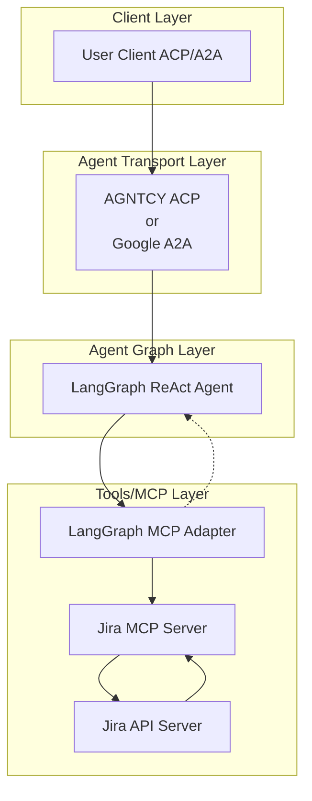

# 🚀 Jira AI Agent

[](https://www.python.org/)
[](https://python-poetry.org/)
[](LICENSE)

[](https://github.com/cnoe-io/openapi-mcp-codegen/actions/workflows/conventional_commits.yml)
[](https://github.com/cnoe-io/openapi-mcp-codegen/actions/workflows/ruff.yml)
[](https://github.com/cnoe-io/openapi-mcp-codegen/actions/workflows/superlinter.yml)


[](https://github.com/cnoe-io/agent-jira/actions/workflows/a2a-docker-build.yml)
---

## 🧪 Evaluation Badges

| Claude | Gemini | OpenAI | Llama |
|--------|--------|--------|-------|
| [](https://github.com/cnoe-io/agent-jira/actions/workflows/claude-evals.yml) | [](https://github.com/cnoe-io/agent-jira/actions/workflows/gemini-evals.yml) | [](https://github.com/cnoe-io/agent-jira/actions/workflows/openai-evals.yml) | [](https://github.com/cnoe-io/agent-jira/actions/workflows/openai-evals.yml) |

---

- 🤖 **Jira Agent** is an LLM-powered agent built using the [LangGraph ReAct Agent](https://langchain-ai.github.io/langgraph/agents/agents/) workflow and [MCP tools](https://modelcontextprotocol.io/introduction).
- 🌐 **Protocol Support:** Compatible with [ACP](https://github.com/agntcy/acp-spec) and [A2A](https://github.com/google/A2A) protocols for integration with external user clients.
- 🛡️ **Secure by Design:** Enforces Jira API token-based RBAC and supports external authentication for strong access control.
- 🔌 **Integrated Communication:** Uses [langchain-mcp-adapters](https://github.com/langchain-ai/langchain-mcp-adapters) to connect with the Jira MCP server within the LangGraph ReAct Agent workflow.
- 🏭 **First-Party MCP Server:** The MCP server is generated by our first-party [openapi-mcp-codegen](https://github.com/cnoe-io/openapi-mcp-codegen/tree/main) utility, ensuring version/API compatibility and software supply chain integrity.

---
## 🚦 Getting Started

### 1️⃣ Configure Environment

- Ensure your `.env` file is set up as described in the [cnoe-agent-utils usage guide](https://github.com/cnoe-io/cnoe-agent-utils#-usage) based on your LLM Provider.
- Refer to [.env.example](.env.example) as an example.

**Example .env file:**
### 1️⃣ Create/Update `.env`

```env
LLM_PROVIDER=

AGENT_NAME=jira

ATLASSIAN_TOKEN=
ATLASSIAN_EMAIL=
ATLASSIAN_API_URL=
ATLASSIAN_VERIFY_SSL=

########### LLM Configuration ###########
# Refer to: https://github.com/cnoe-io/cnoe-agent-utils#-usage
```

**Use the following link to get your own Jira API Token:**

https://id.jira.com/manage-profile/security/api-tokens

### 2️⃣ Start the Agent (A2A Mode)

Run the agent in a Docker container using your `.env` file:

```bash
docker run -p 0.0.0.0:8000:8000 -it\
   -v "$(pwd)/.env:/app/.env"\
   ghcr.io/cnoe-io/agent-jira:a2a-stable
```

### 3️⃣ Run the Client

Use the [agent-chat-cli](https://github.com/cnoe-io/agent-chat-cli) to interact with the agent:

```bash
uvx https://github.com/cnoe-io/agent-chat-cli.git a2a
```

## 🏗️ Architecture



---

## ✨ Features

- 🤖 **LangGraph + LangChain MCP Adapter** for agent orchestration
- 🧠 **Azure OpenAI GPT-4o** as the LLM backend
- 🔗 Connects to Jira via a dedicated [Jira MCP agent](https://github.com/severity1/jira-mcp)
- 🔄 **Multi-protocol support:** Compatible with both **ACP** and **A2A** protocols for flexible integration and multi-agent orchestration

---


### 2️⃣ Start Workflow Server (ACP or A2A)

You can start the workflow server in either ACP or A2A mode:

- **ACP Mode:**
  ```bash
  make run-acp
  ```
- **A2A Mode:**
  ```bash
  make run-a2a
  ```

---

## 🧪 Usage

### ▶️ Test with Jira Server

#### 🏃 Quick Start: Run Jira Locally with Minikube

If you don't have an existing Jira server, you can quickly spin one up using [Minikube](https://minikube.sigs.k8s.io/docs/):

1. **Start Minikube:**

  ```bash
  minikube start
  ```

1. **Install Jira in the `jira` namespace:**
  ```bash
  kubectl create namespace jira
  kubectl apply -n jira -f https://raw.githubusercontent.com/argoproj/argo-cd/stable/manifests/install.yaml
  ```

1. **Expose the Jira API server:**
  ```bash
  kubectl port-forward svc/jira-server -n jira 8080:443
  ```
  The API will be available at `https://localhost:8080`.

1. **Get the Jira admin password:**
  ```bash
  kubectl -n jira get secret jira-initial-admin-secret -o jsonpath="{.data.password}" | base64 -d && echo
  ```

1. **(Optional) Install Jira CLI:**
  ```bash
  brew install jira
  # or see https://argo-cd.readthedocs.io/en/stable/cli_installation/
  ```

For more details, see the [official getting started guide](https://argo-cd.readthedocs.io/en/stable/getting_started/#1-install-argo-cd).

### 1️⃣ Run the ACP Client

To interact with the agent in **ACP mode**:

```bash
make run-acp-client
```

**Configure Environment Variables**

Create or update a `.env` file in your project root with the following:

```env
AGENT_ID="<YOUR_AGENT_ID>"
API_KEY="<YOUR_API_KEY>"
WFSM_PORT="<YOUR_ACP_SERVER_PORT>"
```

**Example Interaction**

```
> Your Question: how can you help?
Agent: I can assist you with managing applications in Jira, including tasks such as:
```

- **Listing Applications**: Retrieve a list of applications with filtering options.
- **Getting Application Details**: Fetch detailed information about a specific application.
- **Creating Applications**: Create new applications in Jira.
- **Updating Applications**: Update existing applications.
- **Deleting Applications**: Remove applications from Jira.
- **Syncing Applications**: Synchronize applications to a specific Git revision.
- **Getting User Info**: Retrieve information about the current user.
- **Getting Jira Settings**: Access server settings.
- **Getting Plugins**: List available plugins.
- **Getting Version Information**: Retrieve Jira API server version.

---

### 2️⃣ Run the A2A Client

To interact with the agent in **A2A mode**:

```bash
make run-a2a-client
```

**Sample Streaming Output**

When running in A2A mode, you’ll see streaming responses like:

```
============================================================
RUNNING STREAMING TEST
============================================================

--- Single Turn Streaming Request ---
--- Streaming Chunk ---
The current version of Jira is **v2.13.3+a25c8a0**. Here are some additional details:

- **Build Date:** 2025-01-03
- **Git Commit:** a25c8a0eef7830be0c2c9074c92dbea8ff23a962
- **Git Tree State:** clean
- **Go Version:** go1.23.1
- **Compiler:** gc
- **Platform:** linux/amd64
- **Kustomize Version:** v5.4.3
- **Helm Version:** v3.15.4+gfa9efb0
- **Kubectl Version:** v0.31.0
- **Jsonnet Version:** v0.20.0
```

---

## 🧬 Internals

- 🛠️ Uses [`create_react_agent`](https://docs.langchain.com/langgraph/agents/react/) for tool-calling
- 🔌 Tools loaded from the **Jira MCP server** (submodule)
- ⚡ MCP server launched via `uv run` with `stdio` transport
- 🕸️ Single-node LangGraph for inference and action routing

---

## 📁 Project Structure

```text
agent_jira/
│
├── agent.py              # LLM + MCP client orchestration
├── langgraph.py          # LangGraph graph definition
├── __main__.py           # CLI entrypoint
├── state.py              # Pydantic state models
└── jira_mcp/           # Git submodule: Jira MCP server

client/
└── client_agent.py       # Agent ACP Client
```

---

## 🧩 MCP Submodule (Jira Tools)

This project uses a **first-party MCP module** generated from the Jira OpenAPI specification using our [openapi-mcp-codegen](https://github.com/cnoe-io/openapi-mcp-codegen/tree/main/examples) utility. The generated MCP server is included as a git submodule in `jira_mcp/`.

All Jira-related LangChain tools are defined by this MCP server implementation, ensuring up-to-date API compatibility and supply chain integrity.

---

## 🔌 MCP Integration

The agent uses [`MultiServerMCPClient`](https://github.com/langchain-ai/langchain-mcp-adapters) to communicate with MCP-compliant services.

**Example (stdio transport):**

```python
async with MultiServerMCPClient(
  {
    "jira": {
      "command": "uv",
      "args": ["run", "/abs/path/to/jira_mcp/server.py"],
      "env": {
        "ATLASSIAN_TOKEN": jira_token,
        "ATLASSIAN_API_URL": jira_api_url,
        "ATLASSIAN_VERIFY_SSL": "false"
      },
      "transport": "stdio",
    }
  }
) as client:
  agent = create_react_agent(model, client.get_tools())
```

**Example (SSE transport):**

```python
async with MultiServerMCPClient(
  {
    "jira": {
      "transport": "sse",
      "url": "http://localhost:8000"
    }
  }
) as client:
  ...
```

---
## Evals

### Running Evals
This evaluation uses [agentevals](https://github.com/langchain-ai/agentevals) to perform strict trajectory match evaluation of the agent's behavior. To run the evaluation suite:


```bash
make evals
```

This will:

- Set up and activate the Python virtual environment
- Install evaluation dependencies (`agentevals`, `tabulate`, `pytest`)
- Run strict trajectory matching tests against the agent

#### Example Output

```
=======================================
 Setting up the Virtual Environment
=======================================
Virtual environment already exists.
=======================================
 Activating virtual environment
=======================================
To activate venv manually, run: source .venv/bin/activate
. .venv/bin/activate
Running Agent Strict Trajectory Matching evals...
Installing agentevals with Poetry...
. .venv/bin/activate && uv add agentevals tabulate pytest
...
set -a && . .env && set +a && uv run evals/strict_match/test_strict_match.py
...
Test ID: jira_agent_1
Prompt: show jira version
Reference Trajectories: [['__start__', 'agent_jira']]
Note: Shows the version of the Jira Server Version.
...
Results:
{'score': True}
...
```

#### Evaluation Results

[Latest Strict Match Eval Results](evals/strict_match/README.md)

---

## 📜 License

Apache 2.0 (see [LICENSE](./LICENSE))

---

## 👥 Maintainers

See [MAINTAINERS.md](MAINTAINERS.md)

- Contributions welcome via PR or issue!

---

## 🙏 Acknowledgements

- [LangGraph](https://github.com/langchain-ai/langgraph) and [LangChain](https://github.com/langchain-ai/langchain) for agent orchestration frameworks.
- [langchain-mcp-adapters](https://github.com/langchain-ai/langchain-mcp-adapters) for MCP integration.
- [AGNTCY Agent Connect Protocol(ACP)](https://docs.agntcy.org/pages/syntactic_sdk/connect.html)
- [AGNTCY Agent Gateway Protocol(AGP)](https://docs.agntcy.org/pages/messaging_sdk/agp-howto.html)
- [AGNTCY Workflow Server Manager (WFSM)](https://github.com/agntcy/workflow-srv-mgr) for deployment and orchestration.
- [Model Context Protocol (MCP)](https://modelcontextprotocol.io/) for the protocol specification.
- [Google A2A](https://github.com/google/A2A/tree/main)
- The open source community for ongoing support and contributions.
