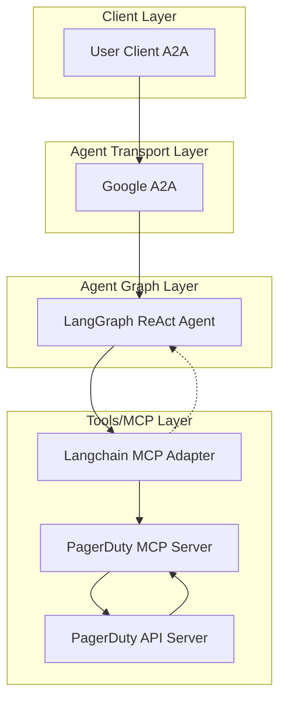

# 🚀 PagerDuty AI Agent

[](https://www.python.org/)
[](https://python-poetry.org/)
[](LICENSE)

[](https://github.com/cnoe-io/openapi-mcp-codegen/actions/workflows/conventional_commits.yml)
[](https://github.com/cnoe-io/openapi-mcp-codegen/actions/workflows/ruff.yml)
[](https://github.com/cnoe-io/openapi-mcp-codegen/actions/workflows/superlinter.yml)
[](https://github.com/cnoe-io/agent-pagerduty/actions/workflows/unit-tests.yml)

[](https://github.com/cnoe-io/agent-pagerduty/actions/workflows/a2a-docker-build.yml)
---

## 🧪 Evaluation Badges

| Claude | Gemini | OpenAI | Llama |
|--------|--------|--------|-------|
| [](https://github.com/cnoe-io/agent-pagerduty/actions/workflows/claude-evals.yml) | [](https://github.com/cnoe-io/agent-pagerduty/actions/workflows/gemini-evals.yml) | [](https://github.com/cnoe-io/agent-pagerduty/actions/workflows/openai-evals.yml) | [](https://github.com/cnoe-io/agent-pagerduty/actions/workflows/openai-evals.yml) |

---

- 🤖 **PagerDuty Agent** is an LLM-powered agent built using the [LangGraph ReAct Agent](https://langchain-ai.github.io/langgraph/agents/agents/) workflow and [MCP tools](https://modelcontextprotocol.io/introduction).
- 🌐 **Protocol Support:** Compatible with [A2A](https://github.com/google/A2A) protocol for integration with external user clients.
- 🛡️ **Secure by Design:** Enforces PagerDuty API token-based authentication and supports external authentication for strong access control.
- 🔌 **Integrated Communication:** Uses [langchain-mcp-adapters](https://github.com/langchain-ai/langchain-mcp-adapters) to connect with the PagerDuty MCP server within the LangGraph ReAct Agent workflow.
- 🏭 **First-Party MCP Server:** The MCP server is generated by our first-party [openapi-mcp-codegen](https://github.com/cnoe-io/openapi-mcp-codegen/tree/main) utility, ensuring version/API compatibility and software supply chain integrity.

---
## 🚀 Getting Started

Running it via Docker:


### 1️⃣ Configure Environment
Ensure your `.env` file is set up as described in the [cnoe-agent-utils usage guide](https://github.com/cnoe-io/cnoe-agent-utils) based on your LLM Provider.

Example `.env` configuration:
```env
############################
# Agent Configuration
############################
LLM_PROVIDER=azure-openai
AGENT_NAME=pagerduty

############################
# Azure OpenAI Configuration
############################
AZURE_OPENAI_API_KEY=<your-azure-key>
AZURE_OPENAI_API_VERSION=2025-04-01-preview
AZURE_OPENAI_DEPLOYMENT=gpt-4.1
AZURE_OPENAI_ENDPOINT=<your-azure-endpoint>

############################
# PagerDuty Configuration
############################
PAGERDUTY_API_KEY=<your-pagerduty-key>
PAGERDUTY_API_URL=https://api.pagerduty.com
```

### 2️⃣ Start the Agent (A2A Mode)

1. Pull the A2A image:

```bash
docker pull ghcr.io/cnoe-io/agent-pagerduty:a2a-stable
```

2. Run the agent in a Docker container using your `.env` file:

```bash
docker pull ghcr.io/cnoe-io/agent-pagerduty:a2a-stable && \
docker run --rm -p 0.0.0.0:8000:8000 -it \
  -v $(pwd)/.env:/app/.env \
  ghcr.io/cnoe-io/agent-pagerduty:a2a-stable
```

### 3️⃣ Run the Client

Use the [agent-chat-cli](https://github.com/cnoe-io/agent-chat-cli) to interact with the agent:

```bash
uvx https://github.com/cnoe-io/agent-chat-cli.git a2a
```

---

## 🏗️ Architecture



## ✨ Features

- 🤖 **LangGraph + LangChain MCP Adapter** for agent orchestration
- 🧠 **Azure OpenAI GPT-4** as the LLM backend
- 🔗 Connects to PagerDuty via a dedicated [PagerDuty MCP agent](https://github.com/cnoe-io/agent-pagerduty/tree/main/agent_pagerduty/protocol_bindings/mcp_server)
- 🔄 **A2A protocol support:** Compatible with **A2A** protocol for flexible integration and multi-agent orchestration
- 📊 **Comprehensive PagerDuty API Support:**
  - Incident Management (create, update, resolve)
  - Service Management
  - Schedule Management
  - Team Management
  - User Management
  - Escalation Policy Management

---

## Local Development

### Alternative: Running Locally
You can also run the agent locally without Docker:

First clone the repo

```bash
git clone https://github.com/cnoe-io/agent-pagerduty.git
cd agent-pagerduty
```

```bash
make run-a2a
```

In a new terminal, start the A2A client:
```bash
make run-a2a-client
```

## Quick Demos

### ▶️ Test with PagerDuty API

#### 🏃 Quick Start: Set Up PagerDuty Access

1. **Create a PagerDuty Account:**
   If you don't have one, sign up at [PagerDuty](https://www.pagerduty.com/).

2. **Generate an API Key:**
   - Log in to your PagerDuty account
   - Go to Configuration → API Access
   - Create a new API key with appropriate permissions
   - Save the API key securely

3. **Get Your PagerDuty Domain:**
   - Your API URL will be `https://api.pagerduty.com`
   - Update the `PAGERDUTY_API_URL` in your `.env` file

### Example Interactions

1. **Incident Management**
```
User: list all active incidents
Agent: Here are the current active incidents:

1. ID: P123ABC - High CPU Usage on Production Server
   Status: triggered
   Urgency: high
   Assigned to: John Smith

2. ID: P456DEF - Database Connection Errors
   Status: acknowledged
   Urgency: medium
   Assigned to: DevOps Team

Let me know if you need more details about any incident or would like to take action!
```

2. **Service Management**
```
User: show me all services
Agent: Here are all the services configured in PagerDuty:

1. Web Application (ID: PS1)
   - Status: active
   - Integration: API
   - Team: Platform

2. Database Cluster (ID: PS2)
   - Status: active
   - Integration: Nagios
   - Team: Infrastructure

3. Payment Gateway (ID: PS3)
   - Status: maintenance
   - Integration: Custom
   - Team: Payments

Would you like more details about any specific service?
```

## 🔍 Troubleshooting

### Common Issues

1. **Docker Issues**
   - Ensure Docker daemon is running
   - Check if you have sufficient permissions
   - Verify the required images are available

2. **Port Conflicts**
   - If port 8000 is in use, modify `A2A_AGENT_PORT` in `.env`
   - Check for other services using required ports

3. **Environment Variables**
   - Verify all required variables in `.env`
   - Check API keys and tokens are valid
   - No trailing spaces in values

4. **Client Connection Issues**
   - Server must be running before client
   - Port numbers should match
   - API keys must match between server and client

### Logs

- Docker: Use `docker logs <container-id>`
- Local: Check terminal output
- Debug mode: Set `DEBUG=true` in `.env`

## 📚 Documentation

For more detailed information about the project, please refer to:

- [API Documentation](docs/api.md) - Detailed API reference
- [Architecture Overview](docs/architecture.md) - System design and components
- [Development Guide](docs/development.md) - Setup and development workflow
- [Deployment Guide](docs/deployment.md) - Production deployment instructions
- [Contributing Guide](CONTRIBUTING.md) - How to contribute to the project
- [Security Policy](SECURITY.md) - Security practices and vulnerability reporting
- [License](LICENSE) - Project license details
- [Changelog](CHANGELOG.md) - Version history and changes
- [Code of Conduct](CODE_OF_CONDUCT.md) - Community guidelines

## 🔐 Security Notes

* Never commit your `.env` file to version control
* Keep your API keys and tokens secure
* Use environment variables or secret managers in production
* Regularly rotate your API keys and tokens

## 👥 Maintainers

See [MAINTAINERS.md](MAINTAINERS.md) for the list of maintainers.

## 🤝 Contributing

We welcome contributions! Please see our [Contributing Guide](CONTRIBUTING.md) for details on how to get started.

## 📄 License

Apache 2.0