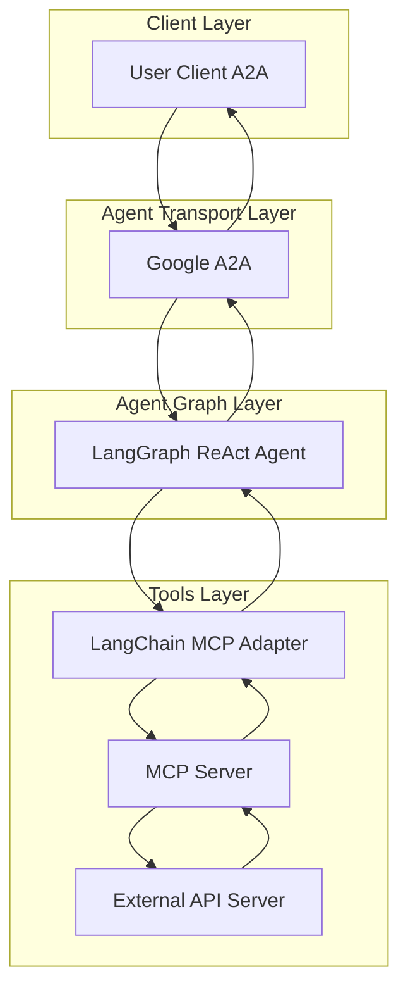

# Agents

## Platform and DevOps Tools Agents

The CAIPE (Community AI Platform Engineering) project provides a comprehensive suite of LLM-powered agents designed for Platform and DevOps tools. Each agent is built using the [LangGraph ReAct Agent](https://langchain-ai.github.io/langgraph/agents/agents/) workflow and [MCP Server](https://modelcontextprotocol.io/introduction) architecture, ensuring consistent, secure, and scalable AI-powered automation.

### 🤖 Available Agents

| Agent | Description | Status | Protocol Support |
|-------|-------------|--------|------------------|
| [ArgoCD](argocd.md) | GitOps continuous delivery for Kubernetes | ✅ Production Ready | A2A |
| [Backstage](backstage.md) | Developer portal and service catalog | ✅ Production Ready | A2A |
| [Confluence](confluence.md) | Team collaboration and documentation | ✅ Production Ready | A2A |
| [GitHub](github.md) | Source code management and collaboration | ✅ Production Ready | A2A |
| [Jira](jira.md) | Project management and issue tracking | ✅ Production Ready | A2A |
| [Komodor](komodor.md) | Kubernetes troubleshooting and monitoring | ✅ Production Ready | A2A |
| [Kubernetes](kubernetes.md) | Container orchestration and management | ✅ Production Ready | A2A |
| [PagerDuty](pagerduty.md) | Incident management and on-call scheduling | ✅ Production Ready | A2A |
| [Slack](slack.md) | Team communication and collaboration | ✅ Production Ready | A2A |
| [Template](template.md) | Template for creating new agents | 🛠️ Development | A2A |

### 🏗️ Architecture Overview

All agents follow a consistent architecture pattern:

### ✨ Key Features

- **🤖 LangGraph Integration**: Built on the powerful LangGraph ReAct Agent framework
- **🔌 MCP Server Architecture**: Uses Model Context Protocol for tool integration
- **🌐 A2A Protocol Support**: Compatible with Google's A2A protocol for agent communication
- **🛡️ Security First**: Token-based RBAC and external authentication support
- **🏭 First-Party MCP Servers**: Generated using our openapi-mcp-codegen utility
- **📊 Comprehensive API Coverage**: Full API coverage through MCP tools
- **🚀 Production Ready**: Docker support, CI/CD pipelines, and evaluation frameworks

### 🎯 Use Cases

#### Platform Engineering
- **Infrastructure Management**: Deploy, scale, and manage Kubernetes clusters
- **GitOps Operations**: Automate continuous delivery with ArgoCD
- **Service Discovery**: Manage service catalogs with Backstage
- **Monitoring & Alerting**: Set up comprehensive monitoring with Komodor

#### DevOps Operations
- **Issue Tracking**: Manage projects and issues with Jira
- **Code Management**: Collaborate on code with GitHub
- **Documentation**: Create and manage documentation with Confluence
- **Communication**: Coordinate teams with Slack
- **Incident Response**: Handle incidents with PagerDuty

#### Development Workflows
- **Code Reviews**: Automate pull request management
- **Deployment Automation**: Streamline deployment processes
- **Monitoring Setup**: Configure monitoring and alerting
- **Team Collaboration**: Enhance team communication and coordination

### 🚀 Getting Started

1. **Choose an Agent**: Select the agent that matches your use case
2. **Configure Environment**: Set up API credentials and configuration
3. **Deploy**: Use Docker or run locally for development
4. **Interact**: Use the A2A client to interact with the agent

### 🔧 Development

#### Creating New Agents

Use the [Template Agent](template.md) as a starting point for creating new agents:

1. Clone the template repository
2. Configure your API integration
3. Generate MCP server using openapi-mcp-codegen
4. Customize prompts and functionality
5. Test and deploy

#### Contributing

We welcome contributions! Please see our [Contributing Guide](../../contributing/README.md) for details on how to get started.

### 📚 Documentation

- [Agent Development Guide](../development/agent-development.md)
- [MCP Server Creation](../tools-utils/mcp-server-creation.md)
- [A2A Protocol Documentation](../architecture/a2a-protocol.md)
- [Testing and Evaluation](../evaluations/agent-evaluation.md)

### 🤝 Community

Join our community to get help, share ideas, and contribute to the project:

- [GitHub Discussions](https://github.com/cnoe-io/ai-platform-engineering/discussions)
- [Discord Server](https://discord.gg/cnoe)
- [Documentation](https://docs.cnoe.io)

### Agentic Workflow Optimization

- **Reflection**: Self-improvement and learning capabilities
- **Multi-Agent Coordination**: Agents can work together on complex tasks
- **Context Awareness**: Maintain context across interactions
- **Adaptive Behavior**: Learn and adapt to user preferences
