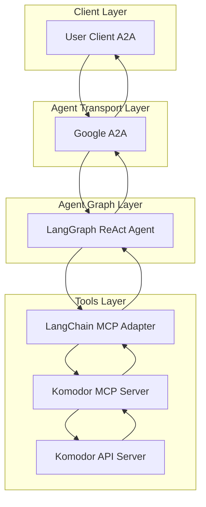
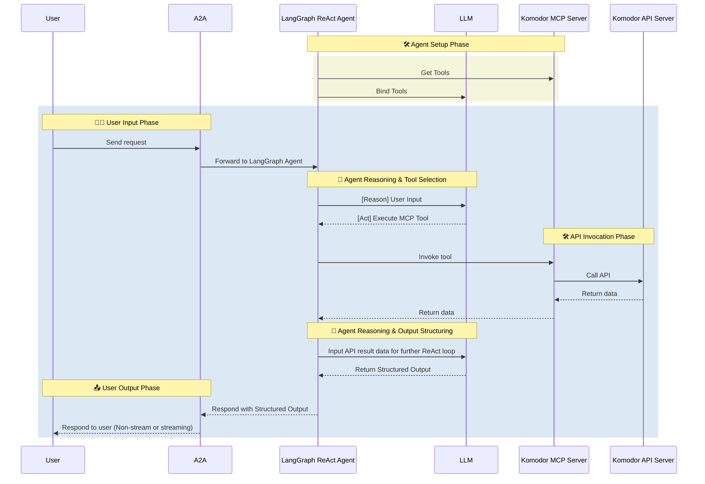

---
sidebar_position: 6
---

# Komodor Agent

- 🤖 **Komodor Agent** is an LLM-powered agent built using the [LangGraph ReAct Agent](https://langchain-ai.github.io/langgraph/agents/agents/) workflow and Komodor [MCP Server](https://modelcontextprotocol.io/introduction).
- 🌐 **Protocol Support:** Compatible with [A2A](https://github.com/google/A2A) protocol for integration with external user clients.
- 🛡️ **Secure by Design:** Enforces Komodor API token-based RBAC and supports secondary external authentication for strong access control.
- 🏭 **MCP Server:** The MCP server is generated by our first-party [openapi-mcp-codegen](https://github.com/cnoe-io/openapi-mcp-codegen/tree/main) utility, ensuring version/API compatibility and software supply chain integrity.
- 🔌 **MCP Tools:** Uses [langchain-mcp-adapters](https://github.com/langchain-ai/langchain-mcp-adapters) to glue the tools from Komodor MCP server to LangGraph ReAct Agent Graph.

## 🏗️ Architecture

### System Diagram



### Sequence Diagram



---

## ⚙️ Local Development Setup

Use this setup to test the agent against Komodor.

### 🔑 Get Komodor API Token

1. Log in to your Komodor account
2. Go to Settings → API Access
3. Create a new API token with appropriate permissions
4. Save the token for your `.env` file

Add to your `.env`:

```env
KOMODOR_TOKEN=<your_token>
KOMODOR_API_URL=https://api.komodor.io
KOMODOR_VERIFY_SSL=true
```

### Run Komodor Sanity tests

```
make komodor-sanity
```

## ✨ Features

- **Application Management**: Create, update, and manage applications
- **Service Discovery**: Discover and monitor services
- **Deployment Management**: Track and manage deployments
- **Incident Management**: Create and manage incidents
- **Monitoring**: Set up and manage monitoring configurations
- **Alerting**: Configure and manage alerts
- **User Management**: Manage users, teams, and permissions
- **Integration Management**: Configure integrations with external tools
- **API Integration**: Full Komodor API coverage through MCP tools

## 🎯 Example Use Cases

Ask the agent natural language questions like:

- **Application Operations**: "Create a new application called 'frontend-service'"
- **Service Discovery**: "Show me all services running in the 'production' environment"
- **Deployment Management**: "Deploy version 1.2.3 of the 'api-service' to production"
- **Incident Management**: "Create an incident for the 'database' service that's down"
- **Monitoring Setup**: "Set up monitoring for the 'payment-service' with CPU and memory alerts"
- **User Management**: "Add user 'john.doe' to the 'DevOps' team"
- **Integration Management**: "Configure Slack integration for deployment notifications"