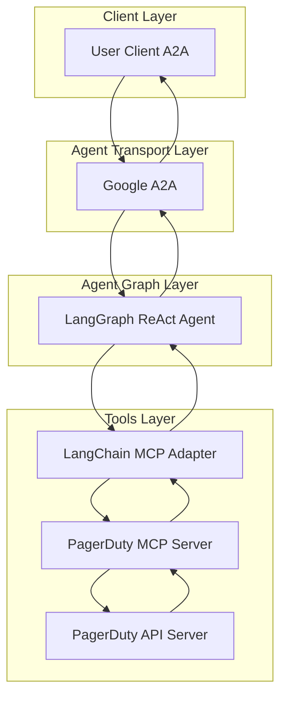

# PagerDuty Agent

- 🤖 **PagerDuty Agent** is an LLM-powered agent built using the [LangGraph ReAct Agent](https://langchain-ai.github.io/langgraph/agents/agents/) workflow and PagerDuty [MCP Server](https://modelcontextprotocol.io/introduction).
- 🌐 **Protocol Support:** Compatible with [A2A](https://github.com/google/A2A) protocol for integration with external user clients.
- 🛡️ **Secure by Design:** Enforces PagerDuty API token-based RBAC and supports secondary external authentication for strong access control.
- 🏭 **MCP Server:** The MCP server is generated by our first-party [openapi-mcp-codegen](https://github.com/cnoe-io/openapi-mcp-codegen/tree/main) utility, ensuring version/API compatibility and software supply chain integrity.
- 🔌 **MCP Tools:** Uses [langchain-mcp-adapters](https://github.com/langchain-ai/langchain-mcp-adapters) to glue the tools from PagerDuty MCP server to LangGraph ReAct Agent Graph.

---

## Architecture



---

## ⚙️ Local Development Setup

### 🔑 Get PagerDuty API Token

- Retrieve PagerDuty API token from pagerduty.com

Add to your `.env`:

```env
PAGERDUTY_API_KEY=
PAGERDUTY_API_URL=https://api.pagerduty.com
```
