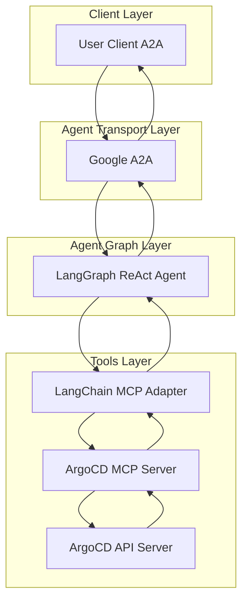

# Sub-Agent Architecture

```mermaid
flowchart TD
  subgraph Client Layer
    A[User Client A2A]
  end
  subgraph Agent Transport Layer
    B[Google A2A]
  end
  subgraph Agent Graph Layer
    C[LangGraph ReAct Agent]
  end
  subgraph Tools Layer
    D[LangChain MCP Adapter]
    E[ArgoCD MCP Server]
    F[ArgoCD API Server]
  end

  A --> B --> C --> D --> E --> F
  F --> E --> D --> C --> B --> A
```
