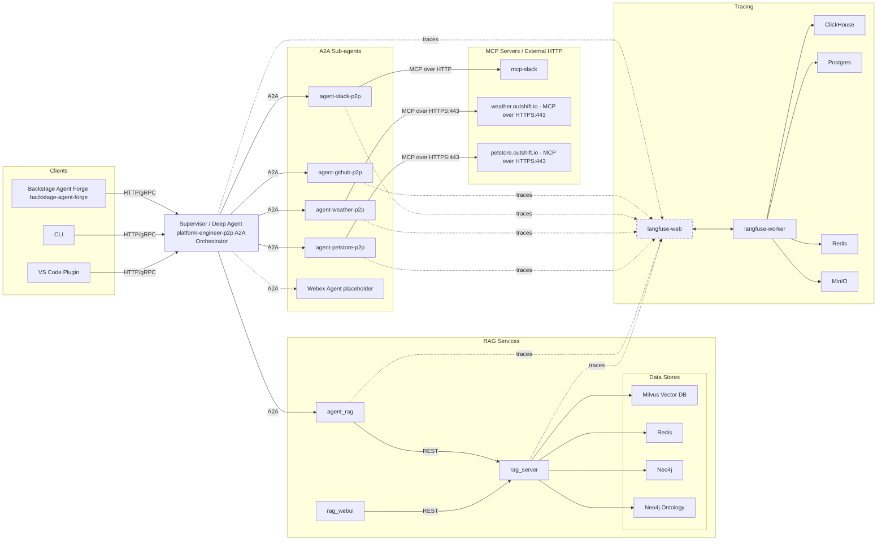

# AI Platform Engineering Architecture

**Status**: 🟢 In-use
**Category**: Architecture & Core Design
**Date**: November 5, 2025 (consolidated)

```mermaid
flowchart LR
  %% Direction
  %% Left-to-right layout as requested
  %% ------------------------------------------------------------

  %% Clients
  subgraph C[Clients]
    BAF[Backstage Agent Forge backstage-agent-forge]
    CLI[CLI]
    VSCode[VS Code Plugin]
  end

  %% Supervisor / Deep Agent
  PE[Supervisor / Deep Agent platform-engineer-p2p A2A Orchestrator]

  %% A2A Subagents
  subgraph SA[A2A Sub-agents]
    GH[agent-github-p2p]
    SL[agent-slack-p2p]
    WX[agent-weather-p2p]
    PS[agent-petstore-p2p]
    %% (WEBEX_AGENT_HOST declared, no service in compose)
    WXBX[Webex Agent placeholder]
  end

  %% MCP / External Services
  subgraph MCP[MCP Servers / External HTTP]
    MSL[mcp-slack]
    WXS[weather.outshift.io - MCP over HTTPS:443]
    PSS[petstore.outshift.io - MCP over HTTPS:443]
  end

  %% RAG Services
  subgraph RAG[RAG Services]
    AR[agent_rag]
    RS[rag_server]
    RW[rag_webui]
    subgraph DS[Data Stores]
      MV[Milvus Vector DB]
      RR[Redis]
      N4J[Neo4j]
      N4JO[Neo4j Ontology]
    end
  end

  %% Tracing (optional)
  subgraph TF[Tracing]
    LFW[langfuse-web]
    LFWK[langfuse-worker]
    CH[ClickHouse]
    PG[Postgres]
    LR[Redis]
    S3[MinIO]
  end

  %% Client -> Supervisor
  BAF -->|HTTP/gRPC| PE
  CLI -->|HTTP/gRPC| PE
  VSCode -->|HTTP/gRPC| PE

  %% Supervisor -> Subagents (A2A P2P)
  PE -->|A2A| GH
  PE -->|A2A| SL
  PE -->|A2A| WX
  PE -->|A2A| PS
  PE -.->|A2A| WXBX

  %% Subagents -> MCP / External over HTTP (streamable)
  SL -->|MCP over HTTP| MSL
  WX -->|MCP over HTTPS:443| WXS
  PS -->|MCP over HTTPS:443| PSS

  %% Supervisor -> RAG
  PE -->|A2A| AR
  AR -->|REST| RS
  RW -->|REST| RS

  %% RAG server -> Data Stores
  RS --> MV
  RS --> RR
  RS --> N4J
  RS --> N4JO

  %% Optional tracing flows (dotted)
  classDef trace stroke-dasharray: 5 5,stroke-width:1.5;
  PE -. traces .-> LFW:::trace
  GH -. traces .-> LFW:::trace
  SL -. traces .-> LFW:::trace
  WX -. traces .-> LFW:::trace
  PS -. traces .-> LFW:::trace
  AR -. traces .-> LFW:::trace
  RS -. traces .-> LFW:::trace

  %% Langfuse internals
  LFW <--> LFWK
  LFWK --> CH
  LFWK --> PG
  LFWK --> LR
  LFWK --> S3
```