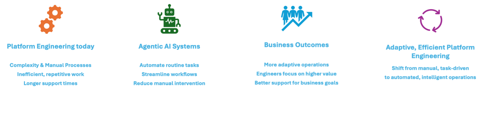

# Introduction

## What is AI Platform Engineering

As [Platform Engineering](https://platformengineering.org/blog/what-is-platform-engineering), [SRE](https://en.wikipedia.org/wiki/Site_reliability_engineering) and [DevOps](https://en.wikipedia.org/wiki/DevOps) environments grow in complexity, traditional approaches to problem solving can introduce delays and increase operational overhead for teams. Developers may experience frustration when workflows become inefficient or manual processes accumulate.

Using *Multi-Agentic Systems* Platform Engineering teams can address the said challenges.

<!-- - Automate repetitive and routine tasks
- Streamline development workflows
- Reduce manual intervention in day-to-day operations
- Focus engineering efforts on higher-value work -->

By incorporating Agentic AI, platform engineering shifts from manual, task-driven processes to more adaptive and efficient operations, allowing teams to better support development and business goals.

## Goals of the project

- Enable Platform Engineering teams with a curated, validated set of persona-specific multi-agent systems (MAS) tailored to their unique enterprise requirements.

- Foster an ecosystem of AI Platform Engineering practitioners to collaboratively develop high-quality, reusable prompt engineering libraries and commonly used platform tools.
- A carefully curated library of meta-prompts, continuously evaluated for effectiveness with both our agents and the MCP server to drive optimal performance in agentic workflows.

## Who we are

We are Platform Engineers, SREs, and Developers from a variety of companies in the [CNCF](https://www.cncf.io/) and [CNOE.io](https://cnoe.io/) ecosystems, passionate about open source and advancing the use of agentic AI in Platform Engineering.