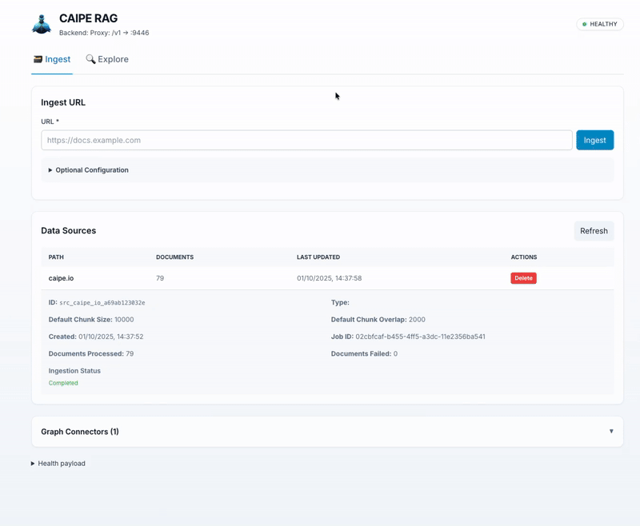

# Knowledge Base Systems

## Knowledge Base Systems Overview

Knowledge base systems are designed to store, manage, and retrieve information efficiently. They play a crucial role in enabling CAIPE to access relevant knowledge quickly, and also assist in reasoning when executing complex tasks. There are currently two primary types of Knowledge base systems:

1. **Vector based system**
  Vector based system is tailored for working with platform runbooks and other forms of unstructured data. The system embeds documents into vector representations, allowing for similarity searches.

2. **Graph based system**
  Graph based system focus on generating knowledge graphs from structured data sources like databases and APIs. This AI agent generates queries on-the-fly to extract relevant information from the knowledge graph, enabling complex reasoning and understanding data relationships.

### Unified RAG Architecture (CAIPE RAG)

Both Vector based system and Graph based system are combined under a unified RAG (Retrieval-Augmented Generation) architecture combining the strengths of both systems. 

CAIPE RAG uses vector search to retrieve relevant unstructured documents such as platform runbooks and documentation. It also uses vector search to locate relevant nodes within the knowledge graph generated from structured data sources. By integrating these two approaches, CAIPE RAG can provide comprehensive and contextually relevant information to enhance its reasoning and decision-making capabilities.


## Getting Started



### 1️⃣ Prerequisites

- Docker and Docker Compose
- Environment variables configured in `.env`

### 2️⃣ Start all services

```bash
# Change to the rag directory
cd ai-platform-engineering/knowledge_bases/rag

# Start all services using Docker Compose
docker compose --profile apps up
```
### 3️⃣ Access the Interface

Interfaces:

  - Web UI: [http://localhost:9447](http://localhost:9447)
  - API Docs: [http://localhost:9446/docs](http://localhost:9446/docs)
  - (Advanced) Neo4j Browser: [http://localhost:7474](http://localhost:7474)
  - (Advanced) Milvus Studio: [http://localhost:9091](http://localhost:9091)

## Features

### Ontology Agent
- Automatic relationship discovery using heuristics
- LLM-powered evaluation of relationship candidates
- Progress tracking with real-time status updates
- Configurable acceptance/rejection thresholds
- Background processing with concurrent task management

### RAG System
- Document ingestion and chunking
- Vector embeddings with Milvus storage
- Semantic search and retrieval
- LLM-powered question answering

### Web Interface
- Interactive graph visualization
- Real-time agent status with progress indicators
- Search functionality across all data
- Entity exploration and relationship browsing


### Further Reading
- [Unified RAG Github discussion](https://github.com/cnoe-io/ai-platform-engineering/discussions/196)
