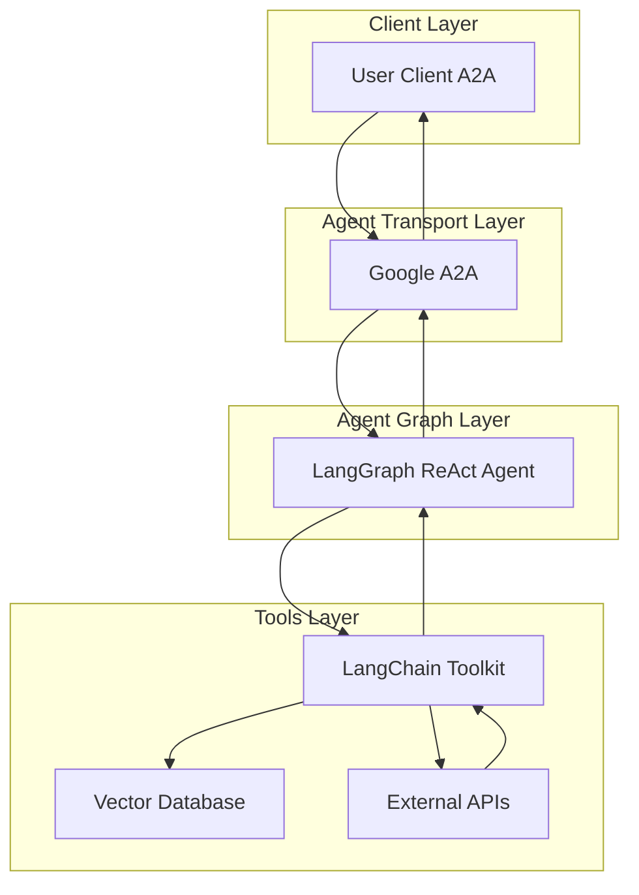

# RAG Agent

- 🤖 **RAG Agent** is an LLM-powered Retrieval-Augmented Generation agent built using the [LangGraph ReAct Agent](https://langchain-ai.github.io/langgraph/agents/agents/) workflow.
- 📚 **Knowledge Retrieval:** Integrates with vector databases like Milvus to retrieve relevant context for queries.
- 🌐 **Protocol Support:** Compatible with [A2A](https://github.com/google/A2A) protocol for seamless integration with external user clients.
- 🛡️ **Secure by Design:** Supports token-based authentication and RBAC for controlled access to data sources.
- 🏭 **Integrations:** Utilizes [langchain-toolkit](https://github.com/langchain-ai/langchain-toolkit) for connecting external APIs and databases to the agent graph.

---

## Architecture

---

## ⚙️ Local Development Setup

🚧 This page is still under construction 🚧