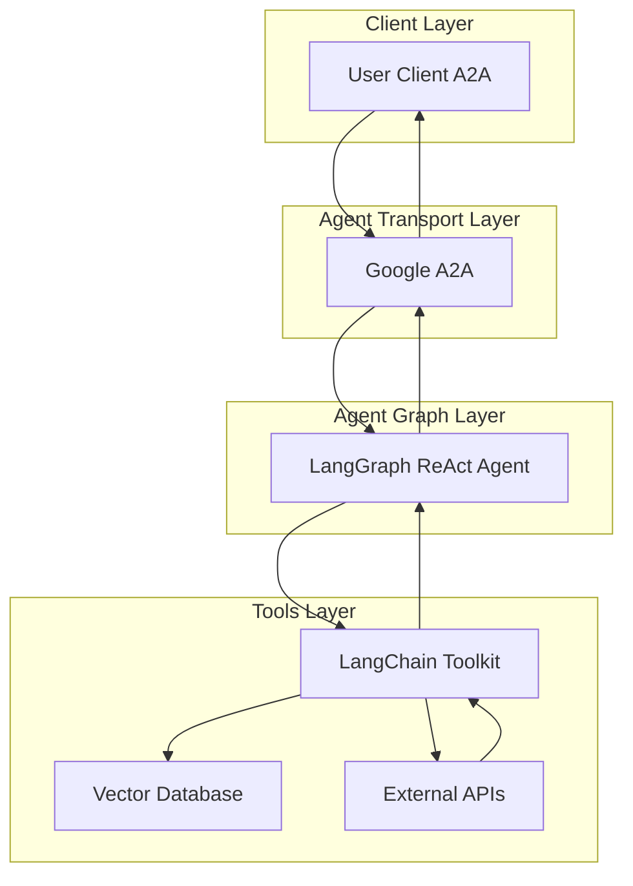

# RAG Agent

- 🤖 **RAG Agent** is an LLM-powered Retrieval-Augmented Generation agent built using the [LangGraph ReAct Agent](https://langchain-ai.github.io/langgraph/agents/agents/) workflow.
- 📚 **Knowledge Retrieval:** Integrates with vector databases like Milvus to retrieve relevant context for queries.
- 🌐 **Protocol Support:** Compatible with [A2A](https://github.com/google/A2A) protocol for seamless integration with external user clients.
- 🛡️ **Secure by Design:** Supports token-based authentication and RBAC for controlled access to data sources.
- 🏭 **Integrations:** Utilizes [langchain-toolkit](https://github.com/langchain-ai/langchain-toolkit) for connecting external APIs and databases to the agent graph.

---

## Architecture



---

## ⚙️ Local Development Setup

### Prerequisites

- Docker and Docker Compose installed
- A configured `.env` file with necessary environment variables

### 1️⃣ Environment Configuration

Update your `.env` file with the following KB-RAG specific variables:

```bash
# Enable KB-RAG functionality
ENABLE_KB_RAG=true

# Vector store collection name (derived from ingestion API)
# Format: rag_YYYYMMDD_<hash>
VSTORE_COLLECTION=rag_20250807_2cz951cb
```

### 2️⃣ Start the RAG Services

Run the following command from the main repository root to start the KB-RAG services:

```bash
docker compose --profile kb-rag --profile p2p up
```

This command will start:
- **kb-rag-agent**: The main RAG agent service (accessible on port 8009)
- **milvus-standalone**: Vector database for storing embeddings (port 19530)
- **etcd**: Coordination service for Milvus
- **milvus-minio**: Object storage for Milvus (port 9000)
- **platform-engineer-p2p**: Main platform engineer with KB-RAG integration (port 8000)

### 3️⃣ Verify Setup

Once the services are running, you can verify the setup by:

1. **Check service health**: All containers should be running and healthy
2. **Access the main platform engineer**: Available at `http://localhost:8000`
3. **Access the RAG agent directly**: Available at `http://localhost:8009`
4. **Milvus Admin UI**: Available at `http://localhost:9091`

### 4️⃣ Configuration Details

#### Environment Variables

Add these two variables to your `.env` file along with all your other existing environment variables:

**ENABLE_KB_RAG**: Set to `true` to enable the KB-RAG functionality in the platform engineer. When enabled, the platform engineer will route documentation-related queries to the RAG agent for enhanced responses using the ingested knowledge base.

**VSTORE_COLLECTION**: Specifies which collection in the Milvus vector database to use for document retrieval. The collection name follows the format `rag_YYYYMMDD_<hash>` where `YYYYMMDD` is the date when the collection was created and `<hash>` is a unique identifier generated by the ingestion API. This collection name is derived from the ingestion API and contains the embedded documents that the RAG agent will search through.

Example `.env` configuration:
```bash
# ... your other existing environment variables ...

# KB-RAG Configuration
ENABLE_KB_RAG=true
VSTORE_COLLECTION=rag_20250807_2cz951cb
```

### 5️⃣ Using the RAG Agent

Once configured and running, the RAG agent can:
- Answer questions based on ingested documentation
- Provide contextual responses using retrieved knowledge
- Integrate seamlessly with the platform engineer's multi-agent workflow

The agent is accessible through the A2A protocol and will automatically be included in the platform engineer's routing when `ENABLE_KB_RAG=true`.