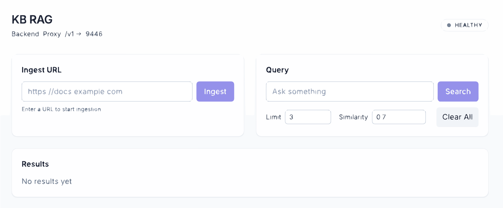
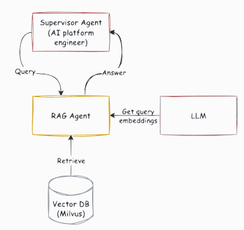

# RAG Ingestion Service

The RAG Ingestion Service provides a convenient way to populate your knowledge base with content from various sources. It includes both a web UI for interactive use and API endpoints for programmatic access.

---

## 🌐 Web UI Interface

The RAG system includes a user-friendly web interface for document ingestion and querying, accessible at `http://localhost:9447` when running the KB-RAG services.



### Features

- **📄 URL Ingestion**: Import content from web pages and documentation sites
- **🔍 Interactive Querying**: Test your knowledge base with real-time search
- **⚙️ Configurable Parameters**: Adjust search limits and similarity thresholds
- **📊 Real-time Status**: Monitor ingestion progress and results

---

## 🚀 Getting Started with Web UI

### 1. Access the Interface

Once your KB-RAG services are running, navigate to:
```
http://localhost:9447
```

### 2. Ingest Content

**Step 1**: In the "Ingest URL" section, enter the URL of the content you want to add:
```
https://docs.example.com
```

**Step 2**: Click the "Ingest" button to start the process

**Step 3**: Monitor the status - you should see confirmation when processing is complete

### 3. Query Your Knowledge Base

**Step 1**: In the "Query" section, enter your question:
```
How do I configure authentication?
```

**Step 2**: Adjust parameters if needed:
- **Limit**: Number of results to return (default: 3)
- **Similarity**: Minimum similarity threshold (default: 0.7)

**Step 3**: Click "Search" to retrieve relevant information

---

## 🔧 How Ingestion Works

The ingestion process follows these steps:



### Processing Steps

1. **Content Crawling**: Fetches content from the provided URL
2. **HTML Parsing**: Extracts meaningful text from HTML structure
3. **Text Chunking**: Splits large documents using [Recursive Text Splitter](https://python.langchain.com/docs/how_to/recursive_text_splitter/)
4. **Embedding Generation**: Converts text chunks to vector embeddings using LLM
5. **Storage**: Saves embeddings and metadata to Milvus vector database

---

## 📡 API Endpoints

For programmatic access, the ingestion service provides REST APIs:

### Ingest Content from URL
```bash
curl -X POST "http://localhost:9447/v1/datasource/ingest/url" \
     -H "Content-Type: application/json" \
     -d '{
       "url": "https://docs.example.com",
       "params": {}
     }'
```

Response:
```json
{
  "job_id": "123e4567-e89b-12d3-a456-426614174000",
  "status": "pending",
  "message": "Ingestion job started"
}
```

### Check Ingestion Status
```bash
curl -X GET "http://localhost:9447/v1/datasource/ingest/status/{job_id}"
```

Response:
```json
{
  "job_id": "123e4567-e89b-12d3-a456-426614174000",
  "status": "completed",
  "progress": {
    "message": "Ingestion completed",
    "processed": 50,
    "total": 50
  },
  "created_at": "2024-01-01T10:00:00",
  "completed_at": "2024-01-01T10:02:30",
  "error": null
}
```

### Query Knowledge Base
```bash
curl -X POST "http://localhost:9447/v1/query" \
     -H "Content-Type: application/json" \
     -d '{
       "query": "How do I deploy applications?",
       "limit": 5,
       "similarity_threshold": 0.7
     }'
```

Response:
```json
{
  "query": "How do I deploy applications?",
  "results": [
    {
      "page_content": "To deploy applications...",
      "metadata": {
        "source": "https://docs.example.com/deploy",
        "title": "Deployment Guide"
      }
    }
  ]
}
```

### Clear All Data
```bash
curl -X POST "http://localhost:9447/v1/datasource/clear_all"
```

### Health Check
```bash
curl -X GET "http://localhost:9447/healthz"
```

Response:
```json
{
  "status": "healthy",
  "timestamp": "2024-01-01T10:00:00"
}
```

---

## ⚙️ Configuration Options

### Collection Management

The ingestion service uses collections to organize different knowledge bases:

- **Default Collection**: `rag_unified` (configurable via `DEFAULT_VSTORE_COLLECTION` environment variable)
- **Collection Format**: All documents are stored in the configured collection
- **Environment Configuration**: Set `DEFAULT_VSTORE_COLLECTION=your_collection_name` to use a custom collection

### Chunking Parameters

Customize how documents are split:

```yaml
chunk_size: 1000          # Characters per chunk
chunk_overlap: 200        # Overlap between chunks
separators: ["\n\n", "\n", " ", ""]  # Split hierarchy
```

### Embedding Configuration

Vector embedding settings:

```yaml
embedding_model: "text-embedding-ada-002"  # Model for embeddings
dimension: 1536                            # Embedding dimensions
```

---

## 🛠️ Advanced Usage

### Batch Ingestion

For multiple URLs, you can script the ingestion using curl:

```bash
#!/bin/bash

urls=(
    "https://docs.example.com/guide1"
    "https://docs.example.com/guide2" 
    "https://docs.example.com/api-reference"
)

for url in "${urls[@]}"; do
    echo "Ingesting: $url"
    job_id=$(curl -s -X POST "http://localhost:9447/v1/datasource/ingest/url" \
                  -H "Content-Type: application/json" \
                  -d "{\"url\": \"$url\", \"params\": {}}" | \
             jq -r '.job_id')
    echo "Job ID: $job_id"
    
    # Wait for completion (optional)
    while true; do
        status=$(curl -s "http://localhost:9447/v1/datasource/ingest/status/$job_id" | jq -r '.status')
        if [ "$status" = "completed" ] || [ "$status" = "failed" ]; then
            echo "Status: $status"
            break
        fi
        echo "Status: $status - waiting..."
        sleep 5
    done
done
```

### Job Status Monitoring

Monitor ingestion progress programmatically:

```bash
# Start ingestion and capture job ID
job_id=$(curl -s -X POST "http://localhost:9447/v1/datasource/ingest/url" \
              -H "Content-Type: application/json" \
              -d '{"url": "https://docs.example.com", "params": {}}' | \
         jq -r '.job_id')

echo "Job started with ID: $job_id"

# Poll for status
while true; do
    response=$(curl -s "http://localhost:9447/v1/datasource/ingest/status/$job_id")
    status=$(echo "$response" | jq -r '.status')
    progress=$(echo "$response" | jq -r '.progress.message')
    
    echo "Status: $status - $progress"
    
    if [ "$status" = "completed" ] || [ "$status" = "failed" ]; then
        echo "Final response:"
        echo "$response" | jq .
        break
    fi
    
    sleep 2
done
```

---

## 🔍 Troubleshooting

### Common Issues

**Ingestion Fails**
- Verify URL is accessible
- Check for authentication requirements
- Ensure sufficient disk space

**No Search Results**
- Lower similarity threshold
- Try different query phrasing
- Verify content was ingested successfully

**Slow Performance**
- Check Milvus database health
- Monitor system resources
- Consider chunking parameters

### Logs and Monitoring

Monitor ingestion progress through Docker logs:

```bash
docker logs kb-rag-server
```

Check RAG service health:
```bash
curl http://localhost:9447/healthz
```

Check Milvus database status:
```bash
curl http://localhost:9091/webui
```

---

## 🎯 Best Practices

### Content Selection
- Choose high-quality, well-structured documentation
- Avoid duplicate content across URLs
- Ensure content is up-to-date and accurate

### Query Optimization
- Use specific, contextual questions
- Include relevant keywords from your domain
- Test different similarity thresholds for your use case

### Data Management
- Use descriptive environment variable names for different deployments
- Clear outdated content using the `/v1/datasource/clear_all` endpoint
- Monitor ingestion job status to ensure successful processing
- Organize different content types in separate service instances if needed

---

## 🔗 Integration Examples

### With Platform Engineer Agent

The ingested content automatically becomes available to the platform engineer agent:

```bash
# Agent will use RAG for documentation queries
"How do I configure SSL certificates?"
```

### With Custom Applications

```bash
# Query the RAG service directly from any application
query_response=$(curl -s -X POST "http://localhost:9447/v1/query" \
                      -H "Content-Type: application/json" \
                      -d '{
                        "query": "deployment process",
                        "limit": 5,
                        "similarity_threshold": 0.7
                      }')

echo "$query_response" | jq '.results[] | {content: .page_content, source: .metadata.source}'
```

For Python integration:
```python
import requests

def query_rag(query: str, limit: int = 3, threshold: float = 0.7):
    response = requests.post(
        "http://localhost:9447/v1/query",
        json={
            "query": query,
            "limit": limit,
            "similarity_threshold": threshold
        }
    )
    return response.json()

# Usage
results = query_rag("How to deploy applications?")
for doc in results["results"]:
    print(f"Content: {doc['page_content']}")
    print(f"Source: {doc['metadata']['source']}")
```

---

## 📚 Related Documentation

- [RAG Agent Overview](./rag.md) - Main RAG agent documentation
- [Graph RAG](./graph_rag.md) - Knowledge graph-based RAG
- [Platform Engineer](../agents/) - Main agent system 