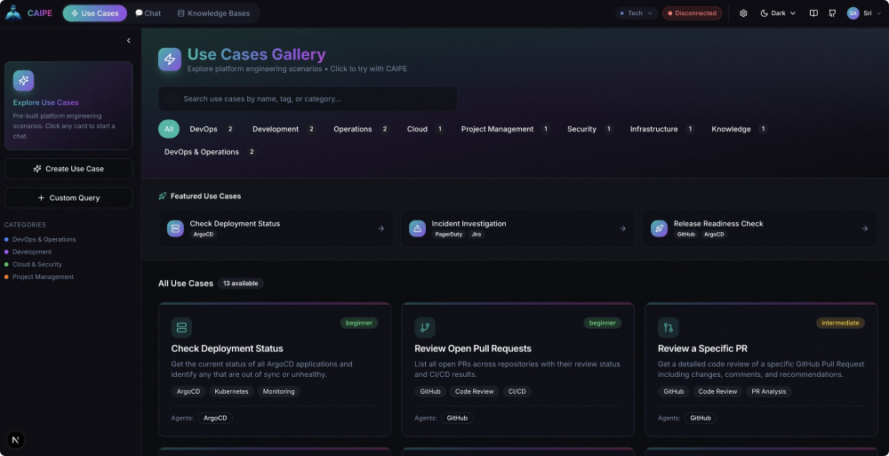
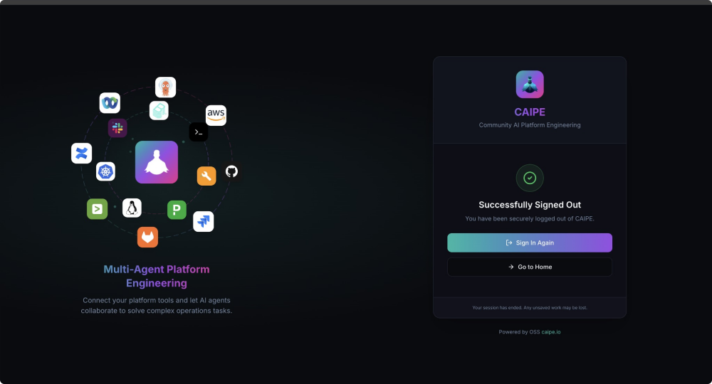

# 🎨 CAIPE UI - Web Interface



The CAIPE UI is a modern, interactive web interface for interacting with the CAIPE Multi-Agent System. Built with Next.js 15 and React 19, it provides an intuitive experience for executing agentic workflows, visualizing A2A protocol messages in real-time, and managing platform engineering tasks.

## Overview

The CAIPE UI serves as the primary graphical interface for platform engineers, SREs, and developers to interact with AI agents. It features a sophisticated 3-panel layout that combines chat interaction, real-time message streaming visualization, and use case exploration.

### Key Features

- **🎯 Use Cases Gallery**: Pre-built scenarios for common platform engineering tasks
- **💬 Interactive Chat**: Natural language interface to communicate with AI agents
- **📡 Real-time Streaming**: Live visualization of A2A protocol messages and events
- **🔐 OAuth Authentication**: Secure login with role-based access control
- **🎨 Modern UI/UX**: Beautiful, responsive design with dark mode support
- **📊 A2UI Widget Support**: Declarative UI components (buttons, forms, tables, etc.)
- **🔍 Message Inspection**: Detailed view of A2A protocol events and artifacts

## Quick Start

### Using Make (Recommended)

```bash
# From repository root - installs dependencies and runs dev server
make caipe-ui

# Or run with Docker Compose (includes supervisor)
make caipe-ui-docker-compose
```

Visit [http://localhost:3000](http://localhost:3000)

### Using Docker Compose

```bash
# Start CAIPE supervisor + UI
COMPOSE_PROFILES=caipe-ui docker compose -f docker-compose.dev.yaml up

# Or with --profile flag
docker compose -f docker-compose.dev.yaml --profile caipe-ui up

# Or start everything (all agents + UI)
COMPOSE_PROFILES="all-agents,caipe-ui" docker compose -f docker-compose.dev.yaml up
```

Visit [http://localhost:3000](http://localhost:3000)

### Local Development

```bash
# From repository root
make caipe-ui-dev

# Or manually from ui directory
cd ui
npm install
npm run dev
```

Visit [http://localhost:3000](http://localhost:3000)

## Architecture

The UI follows a modern React architecture with these core principles:

```
┌─────────────────────────────────────────────────────────────┐
│                        CAIPE UI                             │
├─────────────┬─────────────────────┬─────────────────────────┤
│             │                     │                         │
│  Sidebar    │    Chat Panel       │   Context Panel        │
│  (Use Cases │    (Interaction)    │   (A2A Messages)       │
│   Gallery)  │                     │                         │
│             │                     │                         │
└─────────────┴─────────────────────┴─────────────────────────┘
       │               │                        │
       └───────────────┼────────────────────────┘
                       │
                   A2A Client
                       │
                       ▼
              CAIPE Supervisor
                  (Port 8000)
```

### 3-Panel Layout

1. **Left Panel (Sidebar)**:
   - Use cases gallery with categories
   - Navigation and session management
   - Quick access to common workflows

2. **Center Panel (Chat)**:
   - Main chat interface
   - Message history
   - Final output rendering with markdown support
   - A2UI widget rendering

3. **Right Panel (Context)**:
   - Real-time A2A message stream
   - Event filtering and inspection
   - Artifact visualization
   - Tool execution tracking

## Technology Stack

### Core Framework
- **Framework**: Next.js 15 (App Router, React Server Components)
- **UI Library**: React 19
- **Styling**: Tailwind CSS with custom design system
- **Components**: Radix UI primitives (accessible, unstyled)
- **Icons**: Lucide React

### State & Data Flow
- **State Management**: Zustand (lightweight, scalable)
- **Authentication**: NextAuth.js (OAuth 2.0)
- **A2A Protocol**: Official @a2a-js/sdk (v0.3.9+) via A2ASDKClient wrapper
- **Real-time Streaming**: Server-Sent Events (SSE) via SDK's JsonRpcTransport

### UI/UX
- **Animations**: Framer Motion (smooth transitions)
- **Markdown Rendering**: react-markdown with remark-gfm
- **Syntax Highlighting**: react-syntax-highlighter with Prism
- **Graph Visualization**: Sigma.js (@react-sigma/core) for knowledge graphs
- **Resizable Panels**: react-resizable-panels

### Protocols & Standards
- **A2A Protocol**: Google's Agent-to-Agent protocol for inter-agent communication
- **A2UI Specification**: Declarative UI widgets (custom implementation)
- **AG-UI Compatible**: Aligned with AG-UI patterns (CopilotKit)
- **MCP Integration**: Model Context Protocol for AI tool integration

**Note**: 
- **A2A SDK**: Uses official `@a2a-js/sdk` (v0.3.9+) via `A2ASDKClient` wrapper for standards-compliant agent communication
- **CopilotKit & AG-UI**: Referenced as inspiration; UI uses custom widget implementations following A2UI and AG-UI specifications

## Core Components

### Authentication



The UI supports multiple authentication modes:

- **OAuth 2.0**: Secure authentication with token management
- **Development Mode**: No authentication required (for local development)
- **Session Management**: Automatic token refresh and secure storage

### Use Cases Gallery

Pre-configured scenarios for common platform engineering tasks:

- ☸️ **Check Deployment Status** - Monitor ArgoCD applications
- 🐙 **Review Pull Requests** - GitHub PR management
- 🚨 **Incident Investigation** - Multi-agent incident response
- 💰 **AWS Cost Analysis** - Cloud cost optimization
- 📊 **Sprint Progress** - Jira sprint tracking
- 🔄 **On-Call Handoff** - SRE handoff automation
- 🔒 **Security Vulnerabilities** - Security scanning and reporting
- 🎯 **Cluster Health** - Kubernetes resource monitoring
- 🚀 **Release Readiness** - Pre-deployment checks
- 📚 **Documentation Search** - RAG-powered knowledge search

### A2A Protocol Visualization

Real-time visualization of A2A protocol events:

| Event Type | Description | Visual Indicator |
|------------|-------------|------------------|
| `task` | Task lifecycle events | 🔵 Blue badge with state |
| `artifact-update` | Streaming content | 🟣 Purple badge with preview |
| `status-update` | Final status | 🟢 Green badge with completion |

### A2UI Widget Catalog

Declarative UI components for rich interactions:

- **Button**: Call-to-action buttons with variants
- **Form**: Input forms with validation
- **Card**: Content cards (default, outline, ghost)
- **List**: Ordered/unordered lists with status icons
- **Table**: Data tables with sorting and filtering
- **Progress**: Progress bars and indicators
- **Select**: Dropdown selection menus
- **Input**: Text input fields with validation

## Configuration

### Environment Variables

| Variable | Default (Dev) | Default (Docker) | Description |
|----------|---------------|------------------|-------------|
| `CAIPE_URL` | `http://localhost:8000` | `http://caipe-supervisor:8000` | CAIPE supervisor endpoint |
| `NEXT_PUBLIC_CAIPE_URL` | Same as `CAIPE_URL` | Same as `CAIPE_URL` | Client-side accessible URL |
| `NEXTAUTH_URL` | `http://localhost:3000` | `http://localhost:3000` | NextAuth base URL |
| `NEXTAUTH_SECRET` | (required) | (required) | Secret for session encryption |
| `OAUTH_CLIENT_ID` | (optional) | (optional) | OAuth client ID |
| `OAUTH_CLIENT_SECRET` | (optional) | (optional) | OAuth client secret |
| `USECASE_STORAGE_TYPE` | `file` | `file` | Storage backend: `file` or `mongodb` |

### Authentication Setup

For production deployments, configure OAuth:

```bash
# Generate NextAuth secret
openssl rand -base64 32

# Set environment variables
export NEXTAUTH_SECRET="<generated-secret>"
export OAUTH_CLIENT_ID="<your-client-id>"
export OAUTH_CLIENT_SECRET="<your-client-secret>"
```

For development without authentication:

```bash
# Skip OAuth (development only)
export SKIP_AUTH=true
```

### Use Case Storage

The UI supports two storage backends for user-created use cases:

**File-based (Default)** - No configuration needed
```bash
USECASE_STORAGE_TYPE=file
USECASE_STORAGE_PATH=./data/usecases.json
```

**MongoDB (Production)** - For scalable deployments
```bash
USECASE_STORAGE_TYPE=mongodb
MONGODB_URI=mongodb://localhost:27017/caipe
```

See [Use Case Storage Configuration](../../../ui/USECASE_STORAGE.md) for details.

## Development

### Project Structure

```
ui/
├── src/
│   ├── app/                    # Next.js app router
│   │   ├── api/                # API routes
│   │   ├── login/              # Login page
│   │   ├── logout/             # Logout handler
│   │   ├── unauthorized/       # Access denied page
│   │   ├── layout.tsx          # Root layout with providers
│   │   └── page.tsx            # Main 3-panel layout
│   ├── components/
│   │   ├── a2a/                # A2A protocol components
│   │   │   ├── A2AStreamPanel.tsx
│   │   │   ├── A2UIRenderer.tsx
│   │   │   ├── ContextPanel.tsx
│   │   │   └── widgets/        # A2UI widget library
│   │   ├── chat/               # Chat interface
│   │   │   ├── ChatPanel.tsx
│   │   │   ├── ChatInput.tsx
│   │   │   └── MessageList.tsx
│   │   ├── gallery/            # Use cases gallery
│   │   │   ├── UseCasesGallery.tsx
│   │   │   └── UseCaseCard.tsx
│   │   ├── layout/             # Layout components
│   │   │   └── Sidebar.tsx
│   │   └── ui/                 # Shared UI components
│   ├── hooks/                  # Custom React hooks
│   │   ├── use-a2a-streaming.ts
│   │   └── use-chat.ts
│   ├── lib/                    # Utilities and clients
│   │   ├── a2a-client.ts       # A2A protocol client
│   │   ├── a2a-sdk-client.ts   # SDK-based client
│   │   └── utils.ts            # Helper utilities
│   ├── store/                  # State management
│   │   └── chat-store.ts       # Zustand chat state
│   └── types/                  # TypeScript types
│       └── a2a.ts              # A2A protocol types
├── public/                     # Static assets
│   └── *.svg                   # Agent/tool icons
├── Dockerfile                  # Production Docker image
├── docker-compose.dev.yaml     # Development compose
└── package.json
```

### Building for Production

```bash
# Build optimized production bundle
npm run build

# Run production server
npm start
```

### Linting and Type Checking

```bash
# Run ESLint
npm run lint

# Type check
npx tsc --noEmit
```

## Usage Guide

### Starting a Chat Session

1. Navigate to the UI at [http://localhost:3000](http://localhost:3000)
2. Login with OAuth (or skip in development mode)
3. Click on a use case from the gallery, or type a custom prompt
4. Watch the agents work in real-time in the right panel
5. Review the final response in the center chat panel

### Creating Custom Use Cases

1. Click "Create Use Case" in the gallery
2. Fill in:
   - Title
   - Description
   - Category (deployment, incident, development, etc.)
   - Tags
   - Prompt template
   - Expected agents
   - Difficulty level
3. Save and use immediately

### Inspecting A2A Messages

1. Click on any message in the Context Panel (right side)
2. View the full JSON payload
3. Inspect artifacts, tool calls, and execution plans
4. Filter by event type (task, artifact-update, status-update)

## Integration

### Embedding in Backstage

The CAIPE UI can be embedded as a Backstage plugin:

```bash
# Install the plugin
npm install @caipe/plugin-agent-forge

# Add to Backstage app
import { AgentForgePage } from '@caipe/plugin-agent-forge';
```

See [Agent Forge Plugin Documentation](../getting-started/user-interfaces.md#agent-forge-backstage-plugin) for details.

### API Integration

The UI exposes REST API endpoints for programmatic access:

- `POST /api/chat` - Send messages to agents
- `GET /api/usecases` - Retrieve saved use cases
- `POST /api/usecases` - Save new use cases
- `GET /api/agent-card` - Get agent capabilities

## Troubleshooting

### Connection Issues

**Problem**: Cannot connect to CAIPE supervisor

**Solution**: Verify the `CAIPE_URL` environment variable points to the correct endpoint:

```bash
# Check supervisor is running
curl http://localhost:8000/.well-known/agent-card.json

# Update environment
export CAIPE_URL=http://localhost:8000
```

### Authentication Errors

**Problem**: OAuth authentication fails

**Solution**:
1. Verify OAuth credentials are correct
2. Check `NEXTAUTH_SECRET` is set
3. Use `SKIP_AUTH=true` for local development

### Streaming Not Working

**Problem**: Real-time messages not appearing

**Solution**:
1. Ensure browser supports Server-Sent Events (SSE)
2. Check network tab for active event streams
3. Verify CAIPE supervisor streaming is enabled

## Next Steps

- [User Interfaces Overview](../getting-started/user-interfaces.md)
- [Quick Start Guide](../getting-started/quick-start.md)
- [A2A Protocol Specification](../architecture/a2a-protocol.md)
- [Workshop: Hands-on Training](../workshop/index.md)

## Contributing

Contributions are welcome! Please follow the project's guidelines:

1. Use conventional commits (`feat:`, `fix:`, `docs:`, etc.)
2. Include DCO sign-off: `git commit -s`
3. Run linting before submitting PRs
4. Update documentation for new features

---

**Repository**: [github.com/cnoe-io/ai-platform-engineering](https://github.com/cnoe-io/ai-platform-engineering)

**Questions?** Open an issue or join our community discussions.
