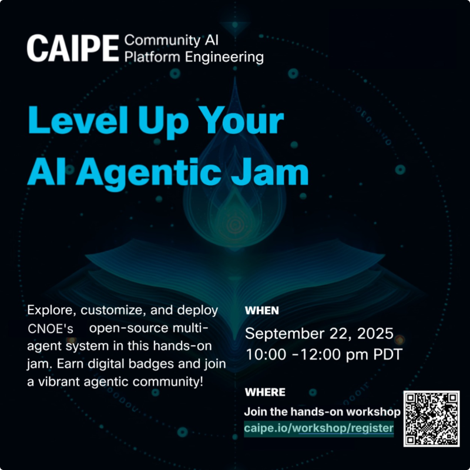

# CAIPE (Community AI Platform Engineering) Hands-On Workshop

**Registration Link - [caipe.io/workshop/register](https://caipe.io/workshop/register)**

Get ready to ⚡ level up with [CAIPE (Community AI Platform Engineering)](https://cnoe-io.github.io/ai-platform-engineering/) in this hands-on workshop where you'll explore, run, modify, deploy, and master an open-source, secure, enterprise-ready, distributed multi-agent system — all while gaining practical experience in building and deploying a production-ready community AI platform.

*You'll:*

• 🚀 Explore and run the full-stack CAIPE in a lab environment provided by the organizers.

• 🧪 Play with real-world use cases, experiment with tools, and customize agents by modifying prompts.

• 🔐 Understand user authentication and authorization across agents and MCP servers to ensure secure, trusted interactions.

• 🔍 Learn distributed tracing, continuous evaluation, and best practices for agent evaluation.

• 🤝 Collaborate with the creators of CAIPE and the open-source community to shape the future of AI Platform Engineering.

• ☸️ Learn how to deploy the full-stack AI platform on Kubernetes and take it to production for enterprise use cases.
