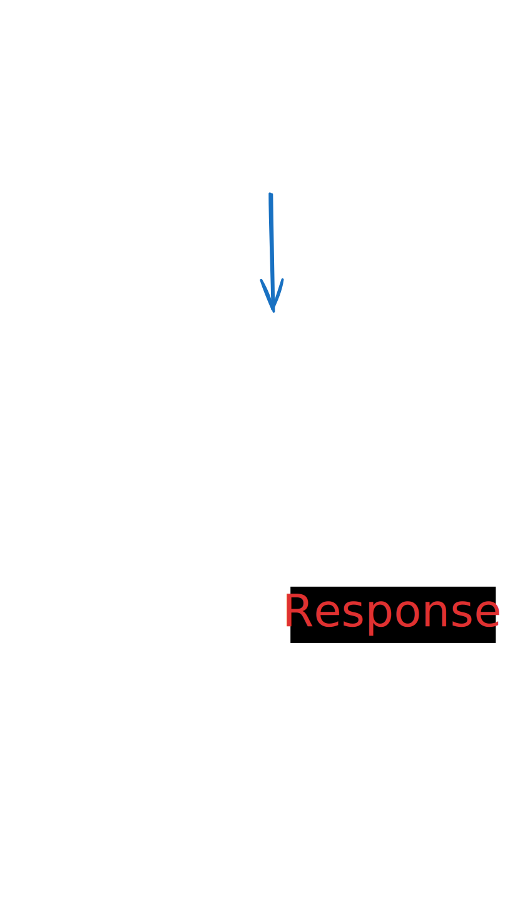
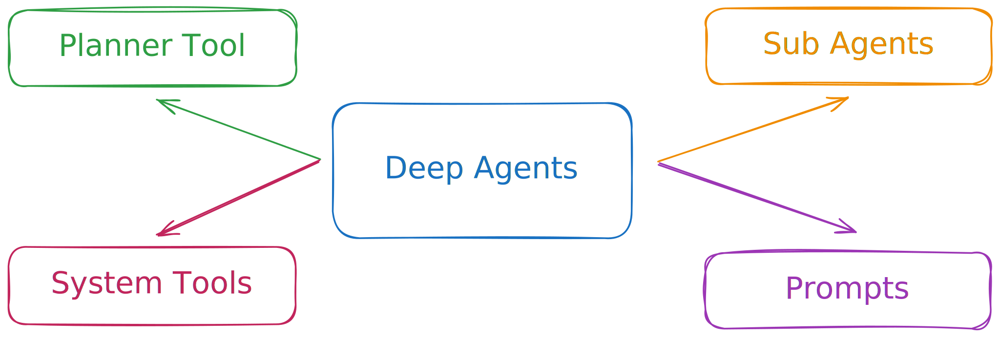
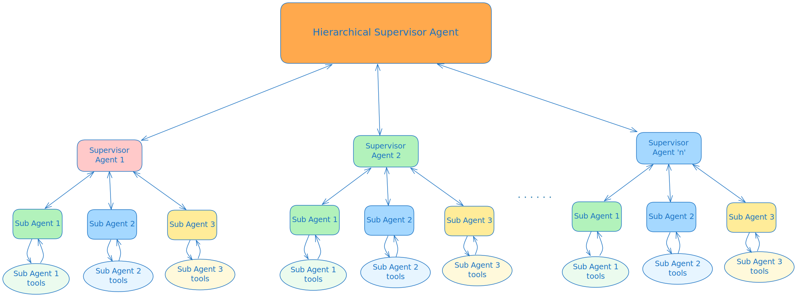

# Mission Check 1 — Start Ignition: Download Mission and Learn the Controls

## Clone CAIPE

Clone the CAIPE (Community AI Platform Engineering) repository

```bash
cd $HOME/work
```

```bash
pwd
```

```bash
git clone https://github.com/cnoe-io/ai-platform-engineering
```


## 🌟 **Support CAIPE with stars!** 🌟
Scan the QR code below or visit the CAIPE repository.


_Link:_ [https://github.com/cnoe-io/ai-platform-engineering](https://github.com/cnoe-io/ai-platform-engineering)

_Please give us a ⭐️ on GitHub. Your support helps grow our community and keeps the project thriving. 🚀_


## 📖🛰️ Download Mission Manual 🚀

* Navigate to CAIP Docs - [https://cnoe-io.github.io/ai-platform-engineering/](https://cnoe-io.github.io/ai-platform-engineering/)
### 📖 Mission Manual Exploration Checklist

- [ ] Explore **Getting Started** → **Quick Start**
- [ ] Explore **Setup** → **Docker** → **Run with Docker Compose**
- [ ] Explore **Setup** → **IDP Builder**


## Agentic AI Concepts

Let's review some key concepts.

## What is an Agent?

An AI Agent is a system that uses a Large Language Model (LLM) to decide the flow of an application

- System Prompts
- Tools
- Memory (Short-term/Long-term)

## Anatomy of agent


## ReAct Loop

Reason and Act (ReAct) is a common
design pattern used in agentic systems to help LLMs decide the next action or tool to use



### [Optional] Try it yourself: Create a Simple ReAct Agent

> **💡 Tip:** Before you begin, check if your Azure credentials are set in your environment.

```bash
env | grep -Ei 'azure' | sed -E 's/(=.{5}).+/\1****/'
```


```bash
pip install -U langgraph "langchain[openai]"
```

```bash
# Create the Python file with LangChain Azure code
cat > $HOME/work/simple_react_agent.py << 'EOF'
from langgraph.prebuilt import create_react_agent  # Import helper to build a ReAct agent
from langchain_openai import AzureChatOpenAI       # Import Azure OpenAI LLM wrapper
import os
import random

# Tool 1: Simulate checking oxygen level in the Mars habitat
def check_oxygen_level() -> str:
    """Returns the current oxygen level in the Mars habitat."""
    print("[TOOL] check_oxygen_level was called")
    oxygen_level = round(random.uniform(18.0, 23.0), 1)
    return f"Oxygen level is optimal at {oxygen_level}%."

# Tool 2: Simulate checking a rover's battery status
def rover_battery_status(rover_name: str) -> str:
    """Returns the battery status for a given Mars rover."""
    print(f"[TOOL] rover_battery_status was called for rover: {rover_name}")
    battery_percent = random.randint(50, 99)
    return f"Rover {rover_name} battery at {battery_percent}% and functioning normally."

# Initialize the Azure OpenAI LLM using environment variables for deployment and API version
llm = AzureChatOpenAI(
    azure_deployment=os.getenv("AZURE_OPENAI_DEPLOYMENT"),      # e.g., "gpt-4o"
    openai_api_version=os.getenv("AZURE_OPENAI_API_VERSION")    # e.g., "2025-03-01-preview"
)

# Create a ReAct agent with the LLM and the two tools above
agent = create_react_agent(
    model=llm,
    tools=[check_oxygen_level, rover_battery_status],
    prompt="You are Mission Control for a Mars colony. Use your tools to help astronauts stay safe and keep the rovers running!"
)

# Run the agent with a user message asking about oxygen and a rover's battery
response = agent.invoke({"messages": [{"role": "user", "content": "Mission Control, what's the oxygen level and the battery status of Rover Spirit?"}]})

# Print the final AI response(s) to the user
print("Final Response:")
for message in response['messages']:
    # Each message is an object with a 'content' attribute (if present)
    if hasattr(message, 'content') and message.content:
        print(f"AI: {message.content}")
EOF
```

```bash
clear && ls -l
```

```bash
python3 $HOME/work/simple_react_agent.py
```


> **✅ Expected Output:**
>
> ```
> Final Response:
> AI: Mission Control, what's the oxygen level and the battery status of Rover Spirit?
> AI: Oxygen level is optimal at 20.5%.
> AI: Rover Spirit battery at 98% and functioning normally.
> AI: The oxygen level in the Mars habitat is optimal at 20.5%, and Rover Spirit's battery is at 98%, functioning normally. Everything looks good!
> ```

## What is a Multi-Agent System (MAS)?

A Multi-Agent System (MAS) is an agentic AI system composed of multiple, independent and interacting agents to achieve a common goal

Here are some example MAS architecture patterns:

### MAS Network/Swarm Architecture

MAS architecture where agents communitcate in a network like pub-sub, multi-cast or broadcast groups. Each agent is aware of and can hand-off to any other agent(s) in the group


### MAS Planner/Deep Agent Architecture

Simple ReAct agents can yield agents that are “shallow”. They are particularly not very good at longer running tasks, more complex tasks with mutli-turn conversations.

A class MAS systems called “Deep Research” agents implement a planner based architecture, to plan a set of tasks and invoke the sub-agents, system tools in combination with Human-in-the-loop. Examples: Claude Code, AWS Q Cli etc.



### MAS Supervisor Architecture

A supervisor agent orchestrates tasks with a bunch of sub-agents with the same system or over network


### MAS Hierarchical Supervisor Architecture

Supervisor of Supervisor agents



**References:**

* [LangChain - Multi-agent systems](https://langchain-ai.github.io/langgraph/concepts/multi_agent/)
* [LangChain - Benchmarking Multi-Agent Architectures](https://blog.langchain.com/benchmarking-multi-agent-architectures/)

## CAPIE Architecture


## MCP (Model Context Protocol)

MCP (Model Context Protocol) standardizes how large language models (LLMs) can get application or API context such as tools, system prompts etc.


### [Optional] Try it yourself: Create a Simple ReAct Agent with MCP Server

```bash
pip install -U langgraph "langchain[openai]"
```

```bash
pip install langchain-mcp-adapters
```

```bash
# Create the MCP server file with Mars colony tools
cat > $HOME/work/simple_mars_mcp_server.py << 'EOF'
from mcp.server.fastmcp import FastMCP
import random

mcp = FastMCP("Mars Colony")

@mcp.tool()
def check_oxygen_level() -> str:
    """Returns the current oxygen level in the Mars habitat."""
    print("Tool called: check_oxygen_level")
    oxygen_level = round(random.uniform(18.0, 23.0), 1)
    return f"Oxygen level is optimal at {oxygen_level}%."

@mcp.tool()
def rover_battery_status(rover_name: str) -> str:
    """Returns the battery status for a given Mars rover."""
    print(f"Tool called: rover_battery_status (rover_name={rover_name})")
    battery_percent = random.randint(50, 99)
    return f"Rover {rover_name} battery at {battery_percent}% and functioning normally."

if __name__ == "__main__":
    mcp.run(transport="stdio")
EOF
```

```bash
clear && ls -l
```

```bash
# Create the MCP client file that connects to the Mars server
cat > $HOME/work/simple_react_agent_using_mcp.py << 'EOF'
import asyncio
from mcp import ClientSession, StdioServerParameters
from mcp.client.stdio import stdio_client
from langchain_mcp_adapters.tools import load_mcp_tools
from langgraph.prebuilt import create_react_agent
from langchain_openai import AzureChatOpenAI
import os

mcp_server_file_path = os.path.join(os.environ["HOME"], "work", "simple_mars_mcp_server.py")

async def main():
    # Create server parameters for stdio connection
    server_params = StdioServerParameters(
        command="python3",
        # Make sure to update to the full absolute path to your simple_mars_mcp_server.py file
        args=[mcp_server_file_path],
    )

    async with stdio_client(server_params) as (read, write):
        async with ClientSession(read, write) as session:
            # Initialize the connection
            await session.initialize()

            # Get tools from the MCP server
            tools = await load_mcp_tools(session)

            # Initialize the Azure OpenAI LLM using environment variables
            llm = AzureChatOpenAI(
                azure_deployment=os.getenv("AZURE_OPENAI_DEPLOYMENT"),
                openai_api_version=os.getenv("AZURE_OPENAI_API_VERSION")
            )

            # Create a ReAct agent with the LLM and the MCP tools
            agent = create_react_agent(
                model=llm,
                tools=tools,
                prompt="You are Mission Control for a Mars colony. Use your tools to help astronauts stay safe and keep the rovers running!"
            )

            # Run the agent with a user message
            agent_response = await agent.ainvoke({
                "messages": [{"role": "user", "content": "Mission Control, what's the oxygen level and the battery status of Rover Spirit?"}]
            })

            # Print the final AI response(s) to the user
            print("Final Response:")
            for message in agent_response['messages']:
                if hasattr(message, 'content') and message.content:
                    print(f"AI: {message.content}")

if __name__ == "__main__":
    asyncio.run(main())
EOF
```

```bash
clear && ls -l
```

```bash
python3 $HOME/work/simple_react_agent_using_mcp.py
```

> **✅ Expected Output:**
>
> ```
> Processing request of type ListToolsRequest
> Processing request of type CallToolRequest
> Processing request of type CallToolRequest
> Final Response:
> AI: Mission Control, what's the oxygen level and the battery status of Rover Spirit?
> AI: Oxygen level is optimal at 22.5%.
> AI: Rover Spirit battery at 76% and functioning normally.
> AI: The oxygen level in the Mars habitat is optimal at 22.5%. The Rover Spirit's battery is at 76% and functioning normally. All systems are running smoothly!
> ```


## Difference between an AI agent vs MCP server

Agentic Systems landscape is evolving rapidly, understanding the distinction between AI Agents and MCP Servers is crucial for building scalable agentic systems. While MCP Servers provide a standardized interface for tools and data sources, AI Agents leverage these capabilities to perform complex reasoning, planning, and execution tasks. As MCP protocol advances the lines are blurring, as of today, AI Agents are superset of what MCP server can do but some agents are directly exposed via MCP.

* [Agent Memory (Long-term and Short-term)](https://blog.langchain.com/memory-for-agents/)
* [Prompt/Context Engineering](https://blog.langchain.com/context-engineering-for-agents/)
* [Agent Orchestration](https://outshift.cisco.com/blog/architecting-jarvis-technical-deep-dive-into-its-multi-agent-system-design?search=jarvis)
* [Tool Pruning via RAG](https://github.com/langchain-ai/langgraph-bigtool)

**Reference blog:**

* [AI Agent vs MCP Server](https://cnoe-io.github.io/ai-platform-engineering/blog/ai-agent-vs-mcp-server)

## A2A Protocol

The Agent2Agent (A2A) Protocol is an open standard designed to enable seamless communication and collaboration between AI agents over the network.


---

### 🚀 Mission 1 Checklist

- [ ] ⭐ Starred the [CAIPE GitHub repository](https://github.com/cnoe-io/ai-platform-engineering)
- [ ] 📖 Checked out the [CAIPE documentation](https://cnoe-io.github.io/ai-platform-engineering/)
- [ ] 🤖 Tried the Simple ReAct Agent example in your environment
- [ ] 🔗 Tried the Simple ReAct Agent with MCP Server integration (see docs/examples)
