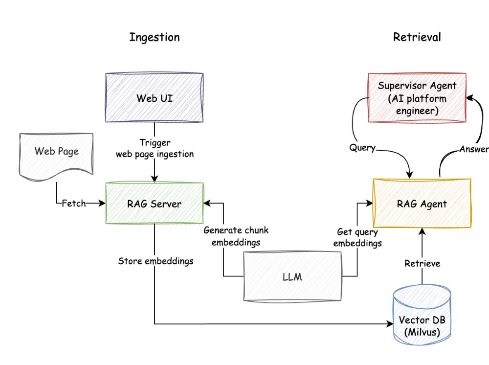
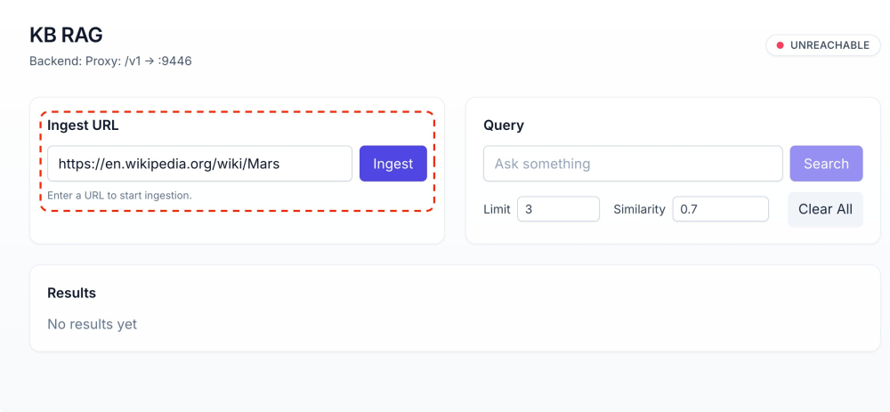
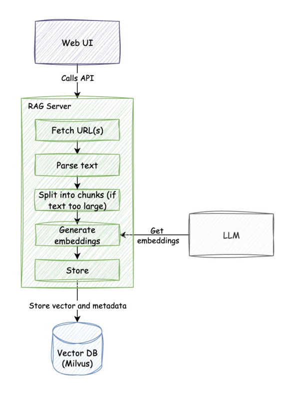

# Mission Check 4 & 5 - Reconnaissance & Reporting back (RAG + Git agent)


## Overview
In this mission, you'll deploy and interact with specialized agents for **knowledge retrieval** and **version control**:

- **📚 RAG Agent**: Use Retrieval-Augmented Generation (RAG) to answer questions about Mars
- **🔧 Git Agent**: Automate git operations like commits, pushes, and repository management

The following diagram shows the architecture of the RAG system:




---

## Step 1: Launch RAG + Git Agent Stack
Make sure you are in the ai-platform-engineering directory:

```bash
cd $HOME/work/ai-platform-engineering
```

Copy over the mission4 environment variables file:

```bash
cp $HOME/.env_vars .env.mission4
```

Start the Docker Compose stack that includes both RAG and Git agents:

```bash
docker compose -f $HOME/work/ai-platform-engineering/workshop/docker-compose.mission4.yaml up
```

**👀 Observe:** You should see the following in the logs:


```console
...
platform-engineer-p2p  |        SLACK AGENT CONFIG      ====
platform-engineer-p2p  | ===================================
platform-engineer-p2p  | AGENT_URL: http://localhost:8000
platform-engineer-p2p  | ===================================
platform-engineer-p2p  | ===================================8000
platform-engineer-p2p  |        KB-RAG AGENT CONFIG      ===
platform-engineer-p2p  | ===================================
platform-engineer-p2p  | AGENT_URL: http://kb-rag-agent:8000
platform-engineer-p2p  | ===================================
platform-engineer-p2p  | 2025-08-26 12:03:18,817 - INFO - Running connectivity checks for 8 agents (max 4 attempts per agent)...
platform-engineer-p2p  |        SLACK AGENT CONFIG
platform-engineer-p2p  | ===================================
platform-engineer-p2p  | AGENT_URL: http://localhost:8000
platform-engineer-p2p  | ===================================
platform-engineer-p2p  | ===================================
platform-engineer-p2p  |        KB-RAG AGENT CONFIG
platform-engineer-p2p  | ===================================
platform-engineer-p2p  | AGENT_URL: http://kb-rag-agent:8000
platform-engineer-p2p  | ===================================
platform-engineer-p2p  | 2025-08-26 12:03:18,817 - INFO - Running connectivity checks for 8 agents (max 4 attempts per agent)...
kb-rag-agent           | INFO:     172.19.0.9:53190 - "GET /.well-known/agent.json HTTP/1.1" 200 OK
agent-github-p2p       | INFO:     172.19.0.9:47004 - "GET /.well-known/agent.json HTTP/1.1" 200 OK
platform-engineer-p2p  | 2025-08-26 12:03:18,895 - INFO - HTTP Request: GET http://kb-rag-agent:8000/.well-known/agent.json "HTTP/1.1 200 OK"
platform-engineer-p2p  | 2025-08-26 12:03:18,895 - INFO - HTTP Request: GET http://kb-rag-agent:8000/.well-known/agent.json "HTTP/1.1 200 OK"
platform-engineer-p2p  | 2025-08-26 12:03:18,895 - INFO - ✅ Agent kb-rag is reachable at http://kb-rag-agent:8000
platform-engineer-p2p  | 2025-08-26 12:03:18,896 - INFO - HTTP Request: GET http://agent-github-p2p:8000/.well-known/agent.json "HTTP/1.1 200 OK"
platform-engineer-p2p  | 2025-08-26 12:03:18,897 - INFO - ✅ Agent github is reachable at http://agent-github-p2p:8000
...
```

The docker-compose stack should start the following services:

- `platform-engineer-p2p` : The platform engineer supervisor agent
- `agent-github-p2p` : The git agent
- `kb-rag-agent` : The RAG agent
- `kb-rag-server` : The RAG server
- `kb-rag-web`: The RAG web UI
- `milvus-standalone`: The Milvus vector database
- `etcd`: Needed for Milvus
- `minio`: Needed for Milvus


**🫸 Wait:** Wait until this process is completed.

Once you see the logs above, you can verify the supervisor agent is healthy by checking the health endpoint.

**💡 Tip:** You can open a new terminal by clicking the **+** button in your terminal window. This allows you to run commands in parallel without stopping your running services.


```bash
curl http://localhost:8000/.well-known/agent.json | jq
```

**👀 Observe:** The response should be a JSON object (the A2A agent card). If you get an error, wait for a few seconds and try again. The agent might still be starting up.

---

## Step 2: Populate RAG database

Now, we will populate the RAG with documentation. The docker-compose stack should have started the `kb-rag-web` service, which is the web ui
for the RAG server.

**🚀 Open RAG Web UI** (Port 6100)

Once the RAG Web UI is open:

1. Copy the URL for Mars wiki page `https://en.wikipedia.org/wiki/Mars` and paste it in `Ingest URL` field
2. Click `Ingest` button
3. **🫸 Wait:** Wait for the ingestion to complete


**👀 Observe:**
- The status in the RAG Web UI should show as `✅ Successfully processed 1 URL(s)`.
- Switch over to the terminal showing your `docker compose logs` and observe the `kb_rag` ingestion logs for details about the document processing.



### Explanation:

Here's what happens:

 - The RAG server crawls webpage (it also supports sitemap), and fetches the page.
 - The HTML is parsed and content is extracted.
 - If the page is too large, it is split into chunks, using [Recursive Text Splitter](https://python.langchain.com/docs/how_to/recursive_text_splitter/).
 - Each chunk is sent to embedding model (LLM in this case) to generate embeddings.
 - The embeddings are stored in a vector store (Milvus), along with metadata (source, title, description etc).




---

## Step 3: Verify RAG System is working
We will now use the UI to query the RAG system and verify it is working.

**Open RAG Web UI again** (Port 6100)

**Type:** `Axial tilt` in the query box, then **Click:** `Search` button

**👀 Observe:** The response should return relevant document chunks. The chunks may not be formatted in a way that is easy to read. As long as some document chunks are returned, the RAG system is working.

---

## Step 4: Using the RAG Agent

**💡 Tip:** You can open a new terminal by clicking the **+** button in your terminal window. This allows you to run commands in parallel without stopping your running services.

```bash
docker run -it --network=host ghcr.io/cnoe-io/agent-chat-cli:stable
```

**💡 Tip:** When asked to `💬 Enter token (optional): `, just press enter ⏎.

In production, your system will use a JWT or Bearer token for authentication here.


This should open a CLI chat client. You can now interact with the supervisor agent.

**Ask the agent:**

```bash
What is the axial tilt of Mars?
```

**👀 Observe:** The agent should respond with the axial tilt of Mars, and cite the source of the information.

### Explanation:

Here's what happens:

 - The RAG agent embeds the question using the same embedding model used to embed the documents.
 - The agent then uses the vector store to find the most similar documents.
 - The agent uses the retrieved document chunks to answer the question.


---

## Step 5: Multi-agent interaction

Now, we will test the multi-agent interaction by asking the supervisor agent to:
 - search for information about Mars (reconnaissance)
 - commit the steps to git repository (report back).


In the CLI chat client, ask the agent:

```bash
Research and write a report on mars surface in markdown format, then commit/upload it as a markdown file named '%%LABNAME%%-report.md' with commit message "mars-surface-report" to repo https://github.com/outshiftcaipe/mission-mars-colony on the `main` branch.
```

**💡 Tip:** Switch to your logs terminal to watch the agents collaborate.

**👀 Observe:** While the agent is working, in the first terminal tab, you should see the ai platform engineering supervisor agent delegate tasks to `kb-rag` and `github` agents. Please note that this step might take a bit of time as the agents go back and forth to figure out the task.


**👀 Observe:**
Back in the CLI chat client, the agent should have:
- Created a report with name: **`%%LABNAME%%-report.md`**
- Committed it to [the workshop git repository](https://github.com/outshiftcaipe/mission-mars-colony) with commit message "mars-surface-report".

### Explanation:

Here's what happens:

 - The supervisor agent determines what needs to be done, and delegates the tasks to the sub agents.
 - It first asks the RAG agent to search for information about Mars surface.
 - The RAG agent uses the vector store to find relavant information, and write a report.
 - The supervisor agent then asks the git agent to commit the report as a text file to the repository.

---


## Final step: Tear down the mult-agent system

Run the following in one of the terminals:

**💡 Tip:** You can open a new terminal by clicking the **+** button in your terminal window. This allows you to run commands in parallel without stopping your running services.

**🛑 Before You Proceed: Bring Down Your Docker Containers**

- **Important:** Run `docker compose down` in your terminal to stop and remove all running containers for this demo before moving on to the next steps.
- This ensures a clean environment and prevents port conflicts or resource issues.

```bash
docker compose -f $HOME/work/ai-platform-engineering/workshop/docker-compose.mission4.yaml down
```

Then close all the tabs that were opened for this mission.

---

## Mission Checks

### 🚀 Reconnaissance & Reporting Mission Checklist

- [ ] **Launch RAG + Git agent stack successfully**
- [ ] **Import Mars wiki into RAG**
- [ ] **Verify RAG queries return relevant documentation**
- [ ] **Connect chat client to supervisor agent**
- [ ] **Test knowledge retrieval: "What is the axial tilt of Mars?"**
- [ ] **Test multi-agent interaction: Documentation search + git operations**

---

## 📖 Further Reading

### RAG Agent

More information on the RAG agent can be found [here](https://github.com/cnoe-io/ai-platform-engineering/tree/main/ai_platform_engineering/knowledge_bases/rag).

### Graph RAG

The AI platform engineering repository also includes **Graph RAG**, which uses Neo4J to create knowledge graphs from structured data (K8s objects, AWS resources).
See the [Graph RAG documentation](https://cnoe-io.github.io/ai-platform-engineering/knowledge_bases/graph_rag) for more details, and how to run it in your local environment.

### Unified Knowledge Base

Currently there is a open discussion on how to unify different RAG systems, and create a unified knowledge base thats specialized for AI platform engineering. Please follow the discussion [here](https://github.com/cnoe-io/ai-platform-engineering/discussions/196).

### Github agent

The Github agent can be used as is. Please refer to the [Github agent documentation](https://github.com/cnoe-io/ai-platform-engineering/tree/main/ai_platform_engineering/agents/github) for more details.

---

## 🛠 Troubleshooting

### Port already in use

If you get a port already in use error from docker, you may still be running containers from previous missions. You can run `docker ps` to see what containers are running, and `docker stop <container_id>` to stop them.

**🛑 Do not stop essential containers**

- **Important:** DO NOT STOP containers with name `etilab` and `localdev-control-plane`. These are needed to run the workshop.

### Terminal refreshed and can't see logs

If your terminal refreshed and you can no longer see the docker compose logs:

```bash
docker compose -f $HOME/work/ai-platform-engineering/workshop/docker-compose.mission4.yaml logs -f --tail 50
```

If you want to see individual container logs, you can use:

```bash
docker logs agent-github-p2p
docker logs kb-rag-agent
docker logs kb-rag-server
docker logs kb-rag-web
docker logs platform-engineer-p2p
```

### Could not find message from source agent

If you see an error similar to this:

```
Could not find message from source agent github_tools_agent. Found names: {'platform_engineer_supervisor'}
```

There might be an issue with the communication between the agents. Try restarting the docker-compose stack by running:

```bash
docker compose -f $HOME/work/ai-platform-engineering/workshop/docker-compose.mission4.yaml down
docker compose -f $HOME/work/ai-platform-engineering/workshop/docker-compose.mission4.yaml up
```

### General errors

If you have issues with any agents not responding properly, try the prompt again after a few seconds, or restart the docker-compose stack as shown above.
