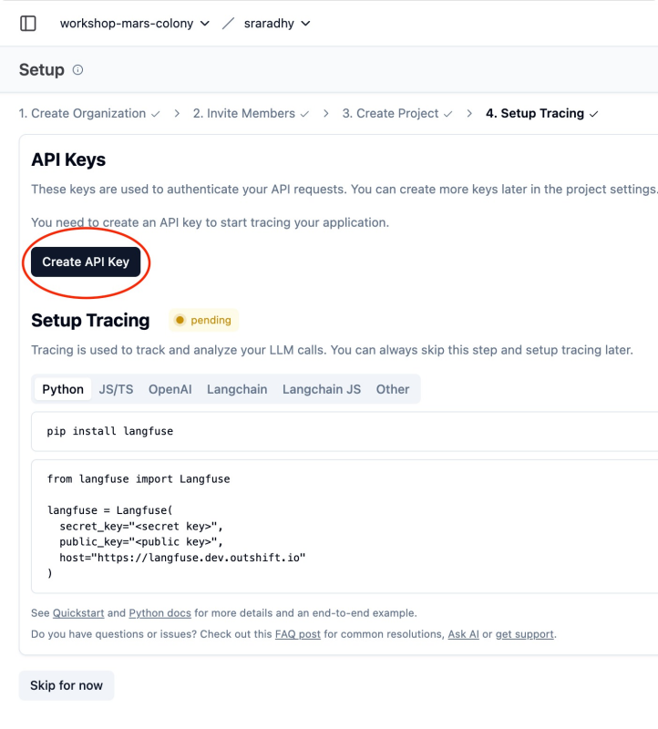

# Mission Check 7 — Tracing and Evaluation

In this mission, you’ll enable tracing with Langfuse and observe your app’s behavior end-to-end.

Steps:

## 1. Log in to Langfuse

**🚀 Click to open Langfuse:** https://langfuse.dev.outshift.io/

   - Login to https://langfuse.dev.outshift.io/
       - **Email:**
       ```
       workshop@outshift.io
       ```
       - **Password:**
       > Ask in [Webex Space](https://eurl.io/#bOa9oXKAn)

## 2. Create an API key

   - In the Langfuse UI, create a new project with your username.
       
       - 
   - Create API Key.
       - 
   - Copy both the Secret and Public keys.
       - 

## 3. Configure your environment

- Change directory to `/home/ubuntu/work`
```bash
cd $HOME/work
```

- Clone repo
```bash
git clone https://github.com/cnoe-io/ai-platform-engineering
```

- Change directory to repo
```bash
cd $HOME/work/ai-platform-engineering
```

**💡 Note:** Update `.env` file with Langfuse API secrets.

- Copy `.env.example` to `.env` if the file doesn't exist or is empty
```bash
if [ ! -f .env ] || [ ! -s .env ]; then
  cp .env.example .env
fi
```

- Copy credentials from bash `env` to `.env` file
```bash
source $HOME/.env_vars && \
sed -i \
  -e 's|^LLM_PROVIDER=.*|LLM_PROVIDER=azure-openai|' \
  -e "s|^AZURE_OPENAI_API_KEY=.*|AZURE_OPENAI_API_KEY=${AZURE_OPENAI_API_KEY}|" \
  -e "s|^AZURE_OPENAI_ENDPOINT=.*|AZURE_OPENAI_ENDPOINT=${AZURE_OPENAI_ENDPOINT}|" \
  -e "s|^AZURE_OPENAI_DEPLOYMENT=.*|AZURE_OPENAI_DEPLOYMENT=${AZURE_OPENAI_DEPLOYMENT}|" \
  -e "s|^AZURE_OPENAI_API_VERSION=.*|AZURE_OPENAI_API_VERSION=${AZURE_OPENAI_API_VERSION}|" \
  -e "s|^GITHUB_PERSONAL_ACCESS_TOKEN=.*|GITHUB_PERSONAL_ACCESS_TOKEN=${GITHUB_PERSONAL_ACCESS_TOKEN}|" \
  .env
```

- Check environment variable (partially masked)
```bash
cat .env | grep -Ei 'azure|github|langfuse' | sed -E 's/(=.{5}).+/\1****/'
```

- Setup Langfuse environment variables
```bash
# Define key-value pairs
declare -A ENV_VARS=(
  ["ENABLE_TRACKING"]="true"
  ["LANGFUSE_TRACING_ENABLED"]="True"
  ["LANGFUSE_HOST"]="https://langfuse.dev.outshift.io"
)

# Update or append each key
for KEY in "${!ENV_VARS[@]}"; do
  VALUE="${ENV_VARS[$KEY]}"
  if grep -q "^${KEY}=" .env; then
    sed -i "s|^${KEY}=.*|${KEY}=${VALUE}|" .env
  else
    echo "${KEY}=${VALUE}" >> .env
  fi
done
```

- Setup LANGFUSE_SECRET_KEY
```bash
# LANGFUSE_SECRET_KEY
read -s -p "Enter your LANGFUSE_SECRET_KEY (pasted text won't show, just press enter): " LF_SEC_KEY; echo
export LANGFUSE_SECRET_KEY="$LF_SEC_KEY"
if grep -q "^LANGFUSE_SECRET_KEY=" .env; then
  sed -i "s|^LANGFUSE_SECRET_KEY=.*|LANGFUSE_SECRET_KEY=$LF_SEC_KEY|" .env
else
  echo "LANGFUSE_SECRET_KEY=$LF_SEC_KEY" >> .env
fi
```

- Setup LANGFUSE_PUBLIC_KEY
```bash
# LANGFUSE_PUBLIC_KEY
read -s -p "Enter your LANGFUSE_PUBLIC_KEY (pasted text won't show, just press enter): " LF_PUB_KEY; echo
export LANGFUSE_PUBLIC_KEY="$LF_PUB_KEY"
if grep -q "^LANGFUSE_PUBLIC_KEY=" .env; then
  sed -i "s|^LANGFUSE_PUBLIC_KEY=.*|LANGFUSE_PUBLIC_KEY=$LF_PUB_KEY|" .env
else
  echo "LANGFUSE_PUBLIC_KEY=$LF_PUB_KEY" >> .env
fi
```

- Check environment variable (partially masked)
```bash
cat .env | grep -Ei 'azure|github|langfuse' | sed -E 's/(=.{5}).+/\1****/'
```

## 4. Start Mission 7 services

**Run:**

```bash
IMAGE_TAG=latest ENABLE_TRACING=true LANGFUSE_SECRET_KEY=$LANGFUSE_SECRET_KEY LANGFUSE_PUBLIC_KEY=$LANGFUSE_PUBLIC_KEY LANGFUSE_HOST=https://langfuse.dev.outshift.io LANGFUSE_TRACING_ENABLED=True docker compose -f workshop/docker-compose.mission7.yaml up -d
```

```bash
docker compose -f workshop/docker-compose.mission7.yaml logs -f
```

## 5. Run the chat CLI and make an example query

**Run:**

**💡 Tip:** You can open a new terminal by clicking the **+** button in your terminal window. This allows you to run commands in parallel without stopping your running services.

```bash
docker run -it --network=host ghcr.io/cnoe-io/agent-chat-cli:stable
```

**💡 Tip:** When asked to `💬 Enter token (optional): `, just press enter ⏎.

In production, your system will use a JWT or Bearer token for authentication here.


- Ask a question:

```bash
What's the weather in london?
```

```bash
show my github info
```

```bash
How is the weather in San Jose? and tabule github activity in cnoe-io org and compare it with 5 day forecast
```

## 6. View the trace in Langfuse

**🚀 Open Langfuse Observability Dashboard:** https://langfuse.dev.outshift.io/

   - Return to the Langfuse dashboard.
   - Open Traces and find the new trace for your query.
   - Explore the spans, inputs/outputs, and timing.

### ✅ Success Criteria Checklist

- [ ] You can see a complete, versioned trace for your query in Langfuse.
- [ ] Your environment is configured for reproducible tracing during development.


## 7. Tear down

**🛑 Before You Proceed: Bring Down Your Docker Containers**

- **Important:** Run `docker compose down` in your terminal to stop and remove all running containers for this demo before moving on to the next steps.
- This ensures a clean environment and prevents port conflicts or resource issues.

```bash
cd $HOME/work/ai-platform-engineering && docker compose -f workshop/docker-compose.mission7.yaml down
```
