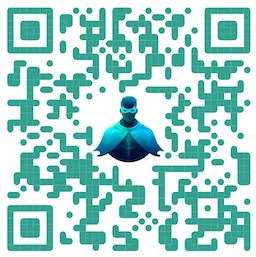

# CAIPE (Community AI Platform Engineering)

Community AI Platform Engineering (CAIPE - pronounced as cape) is an open-source, Multi-Agentic AI System (MAS) championed by the CNOE (Cloud Native Operational Excellence) forum. CAIPE provides a secure, scalable, persona-driven reference implementation with built-in knowledge base retrieval that streamlines platform operations, accelerates workflows, and fosters innovation for modern engineering teams. It integrates seamlessly with Internal Developer Portals like Backstage and developer environments such as VS Code, enabling frictionless adoption and extensibility.

  CAIPE is empowered by a set of specialized sub-agents that integrate seamlessly with essential engineering tools. Below are some common platform agents leveraged by the MAS agent:

* ☁️ AWS Agent for cloud ops
* 🚀 ArgoCD Agent for continuous deployment
* 🚨 PagerDuty Agent for incident management
* 🐙 GitHub Agent for version control
* 🗂️ Jira/Confluence Agent for project management
* 💬 Slack/Webex Agents for team communication
* 📊 Splunk Agent for observability

...and many more platform agents are available for additional tools and use cases. Bring your own enterprise agent that is A2A compatible and connect with CAIPE for multi-agent interaction and agentic problem solving.

Together, these sub-agents enable users to perform complex operations using agentic workflows by invoking relavant APIs using MCP tools. The system also includes:

 - A curated prompt library: A carefully evaluated collection of prompts designed for high accuracy and optimal workflow performance in multi-agent systems. These prompts guide persona agents (such as "Platform Engineer" or "Incident Engineer") using standardized instructions and questions, ensuring effective collaboration, incident response, platform operations, and knowledge sharing.

 - Multiple End-user interfaces: Easily invoke agentic workflows programmatically using standard A2A protocol or through intuitive UIs, enabling seamless integration with existing systems like Backstage (Internal Developer Portals).

 - End-to-end security: Secure agentic communication and task execution across all agents, ensuring API RBACs to meet enterprise requirements.

 - Enterprise-ready cloud deployment architecture: Reference deployment patterns for scalable, secure, and resilient multi-agent systems in cloud and hybrid environments

**References:**

- [https://cnoe-io.github.io/ai-platform-engineering/](https://cnoe-io.github.io/ai-platform-engineering/)

## 🌟 **Support CAIPE with stars!** 🌟
Scan the QR code below or visit the CAIPE repository.

_Link:_ [https://github.com/cnoe-io/ai-platform-engineering](https://github.com/cnoe-io/ai-platform-engineering)

_Please ⭐ the project on GitHub to bookmark it and show your support 🙌
Let’s change the future together 🚀_

"