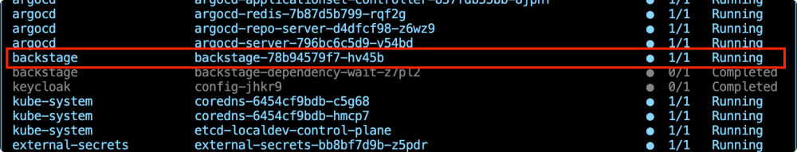

# Deploy CAIPE with IDPBuilder

IDPBuilder is a CLI tool that creates a KIND cluster and deploys platform components via ArgoCD. The CAIPE stack adds authentication, secret management, and multi-agent AI capabilities.


## Component Flow

1. **IDPBuilder Initialization**: Creates KIND cluster and deploys ArgoCD + Gitea as foundation
2. **Platform Deployment**: ArgoCD deploys all platform components from Git repositories
3. **Authentication Setup**: Keycloak provides SSO for Backstage and other platform services
4. **Secret Management**: Vault stores secrets, External Secrets distributes to applications
5. **Developer Access**: NGINX Ingress routes traffic, Backstage provides developer portal
6. **AI Integration**: Agent-Forge plugin in Backstage connects to CAIPE MAS Agent
7. **Multi-Agent System**: Orchestrator manages individual agents for different platform domains

## Deploy the platform

### Clone the repositories.

We use an additional stack to add authentication, secret management, and multi-agent AI capabilities:

```bash
cd $HOME/work
git clone https://github.com/cnoe-io/stacks.git
```

Adjust the urls in the deployment to match the lab/local environment. (if deployment is done on your local pc you can ignore theses steps)

```bash
cd $HOME/work/stacks/ref-implementation
find . -type f -name "*.yaml" -exec sed -i "s/cnoe\.localtest\.me/%%LABURL%%/g" {} +
cd $HOME/work/stacks/caipe
find . -type f -name "*.yaml" -exec sed -i "s/cnoe\.localtest\.me/%%LABURL%%/g" {} +
```

### Deploy the platform.

Please use the following command to install idpbuilder

```bash
wget https://github.com/suwhang-cisco/idpbuilder/releases/download/v0.10.1-fix-7/idpbuilder
chmod +x ./idpbuilder
sudo mv ./idpbuilder /usr/bin
```

Start the deployment

```bash
cd $HOME/work
idpbuilder create --use-path-routing --host %%LABURL%% --port 8443 \
--package $HOME/work/stacks/ref-implementation \
--package $HOME/work/stacks/caipe/base
```

> After the command completes, you should see output like the sample below. This confirms KIND
cluster creation and that ArgoCD is reachable, but it does not mean the whole platform is
fully deployed. ArgoCD will continue pulling images and bringing pods online, which typically
takes around **5-10 minutes.**

```text
...
########################### Finished Creating IDP Successfully! ############################

Can Access ArgoCD at `https://cnoe.localtest.me:8443/argocd`
Username: admin
Password can be retrieved by running: idpbuilder get secrets -p argocd
```

### Check the status of the pods in the cluster

```bash
kubectl get pods -A
```

You should see output similar to the one below:

```text
outshift> kubectl get pods -A
NAMESPACE            NAME                                                READY   STATUS      RESTARTS        AGE
argo                 argo-server-6cfdd5ffd7-9nlfc                        1/1     Running     0               57s
argo                 workflow-controller-997b58f6d-6lwm6                 1/1     Running     0               6m38s
argocd               argocd-application-controller-0                     1/1     Running     0               7m28s
argocd               argocd-applicationset-controller-6c6d75b86f-q25gz   1/1     Running     0               7m28s
argocd               argocd-redis-6668955c45-tp7xp                       1/1     Running     0               7m28s
argocd               argocd-repo-server-7fd9bd6445-s59gh                 1/1     Running     0               7m28s
argocd               argocd-server-5db575d9fb-qtll7                      1/1     Running     0               7m28s
backstage            backstage-54d9f67c8d-dscdj                          1/1     Running     0               53s
backstage            postgresql-0                                        1/1     Running     0               57s
external-secrets     external-secrets-77d6658564-22l7z                   1/1     Running     0               6m49s
external-secrets     external-secrets-cert-controller-754b859548-xs4v7   1/1     Running     0               6m49s
external-secrets     external-secrets-webhook-85d48758f-wfg84            1/1     Running     0               6m49s
gitea                my-gitea-6847557d4d-r7t9v                           1/1     Running     0               8m10s
...
```

> Please wait to see all the pods are created and running, except the ones from the
ai-platform-engineering namespace. Run this command until the output is similar with the one
before - check that **backstage** pod (not only backstage-dependency...) is in Running state.


If you are familar with `k9s`, you can also run `k9s` to see the status of the pods in the cluster (press 0 to see all pods if the list is empty).

```bash
k9s
```
Press 0 in order to see all pods. (Ctrl + c to exit)



### Set the TLS certificate

Run below commands to set the TLS certificate for the cluster:

```bash
TLS_SECRET_NAME="idp-tls"
FULLCHAIN="/etc/cert/fullchain.pem"
PRIVKEY="/etc/cert/privkey.pem"

echo ">>> Waiting for ingress-nginx to become Available ..."
kubectl wait --for=condition=Available --timeout=180s deployment -A \
  -l app.kubernetes.io/name=ingress-nginx || true

echo ">>> Creating/updating TLS secret '${TLS_SECRET_NAME}' in namespaces that have Ingresses ..."
NS_LIST="$(kubectl get ingress -A -o jsonpath='{range .items[*]}{.metadata.namespace}{"\n"}{end}' | sort -u)"

echo "$NS_LIST" | while IFS= read -r NS; do
  [ -n "$NS" ] || continue
  echo "  - namespace: $NS"
  kubectl -n "$NS" create secret tls "$TLS_SECRET_NAME" \
    --cert="$FULLCHAIN" --key="$PRIVKEY" \
    --dry-run=client -o yaml | kubectl apply -f -
done

echo ">>> Patching Ingress objects to attach TLS"
echo "$NS_LIST" | while IFS= read -r NS; do
  [ -n "$NS" ] || continue
  IG_LIST="$(kubectl -n "$NS" get ingress -o jsonpath='{range .items[*]}{.metadata.name}{"\n"}{end}')"
  echo "$IG_LIST" | while IFS= read -r NAME; do
    [ -n "$NAME" ] || continue
    echo "  - ${NS}/${NAME}"
    kubectl -n "$NS" get ingress "$NAME" -o json \
    | jq --arg secret "$TLS_SECRET_NAME" '
        . as $orig
        | ([
            ($orig.spec.rules[]? | .host? // null)
          ] | map(select(. != null and . != "")) | unique) as $hosts
        | if ($hosts | length) > 0 then
            .spec.tls = [{hosts: $hosts, secretName: $secret}]
          else
            .spec.tls = [{secretName: $secret}]
          end
      ' | kubectl apply -f - >/dev/null
  done
done
```

### Optional - Access ArgoCD and Monitor Deployments

Once the cluster is created, IDPBuilder outputs the ArgoCD URL for monitoring your colony's platform deployment.

Extract admin credentials for the ArgoCD UI:

```bash
idpbuilder get secrets -p argocd
```

Open ArgoCD by clicking here (use the lab panel interface) and login with the retrieved credentials. (You can resize the lab content view to have better visibility for ArgoCD)

From the ArgoCD UI, you can monitor the sync status of all the argocd applications  - for example the Vault application. Wait until the sync status is `Synced` for Vault like below:

**Note:** Vault will be on the 2nd page of the ArgoCD UI.

Click here or on the Terminals icon to go back to the terminal view. You can switch back at any point.

<!--  -->

## Configure Vault Secrets for the caipe stack

The following agents are enabled by default: GitHub, ArgoCD, and Backstage.

We also require LLM credentials to be configured for each agent to work.

For ArgoCD and Backstage, we will automatically populate the secrets for you to use the local deployment credentials.

### Confiugure your details

The Github access token was already configured in the previous section of the workshop.
The LLM connection details are already provided for you as part of the lab.
For LLM connectivity, currently Azure OpenAI, OpenAI, and AWS Bedrock are supported.

Check out [the documentation](https://cnoe-io.github.io/ai-platform-engineering/getting-started/idpbuilder/setup#step-3-update-secrets) for more details.

### Add credentials to vault

Now that we have the needed secrets for the agents, we need to populate them in the vault and to refresh the secrets in the stack.
Run below command to do all these steps. (If you prefer to set those manually, please refer to the documentation):

```bash
$HOME/work/stacks/caipe/scripts/setup-all.sh --envFile $HOME/.env_vars
```

Verify secret are stored in the cluster

```bash
kubectl get secrets -n ai-platform-engineering
```

Verify that the pods in the ai-platform-engineering are Running now
```bash
kubectl get pods -n ai-platform-engineering
```
You should see an output similar with:

```text
outshift> kubectl get pods -n ai-platform-engineering
NAME                                                           READY   STATUS    RESTARTS   AGE
ai-platform-engineering-agent-argocd-66d78df58c-tm6tn          1/1     Running   0          2m51s
ai-platform-engineering-agent-argocd-mcp-77f6c6cdff-5nslq      1/1     Running   0          2m51s
ai-platform-engineering-agent-backstage-9c4bcc899-mnvbx        1/1     Running   0          2m51s
ai-platform-engineering-agent-backstage-mcp-5677bdfb85-5jl25   1/1     Running   0          2m51s
ai-platform-engineering-agent-github-7b656f7cc-qb9lh           1/1     Running   0          2m51s
ai-platform-engineering-supervisor-agent-6c8948c5b6-tncvq      1/1     Running   0          2m51s
```

## Access Developer Portal (Backstage)

First fetch the user password for the user1:

```bash
kubectl -n keycloak get secret keycloak-config -o jsonpath='{.data.USER_PASSWORD}' | base64 -d; echo
```

We need to authenticate to Backstage using Keycloack in a new tab. After successful authetication please close the tab and come back to the lab.

Copy the password, open Backstage in your browser and login with:

- Username: `user1`
- Password: `<from the command above>`

Open Backstage at: `https://cnoe.localtest.me:8443/`

## Activate the Agent forge AI Assistant

Access and test the multi-agent AI system integrated into Backstage.

### Access the AI Assistant

Open Backstage (use the lab panel interface)

(you can resize the panels to have better visibility, also use full-screen view for Backstage)

1. Look for the AI agent icon in the bottom-right corner
2. Click to open the AI assistant
3. Start interacting with the multi-agent platform engineering system

<!--  -->

### Test Basic Functionality

Try a first interaction:

```text
What can you do?
```

### Test Agent-Specific Features

Try out different interactions with the supervisor agent. Some examples commands you can try out are:

**ArgoCd information**:
```text
What ArgoCD version are you using?
```

**Backstage Info**:
```text
Show me current software catalog version
```

**Github Info**:
```text
Show me the repositories I have
```

Feel free to try out other agents as well.

## Troubleshooting

Be sure to be in Terminal mode.

### Check IDPBuilder logs

```bash
idpbuilder get logs
```

### Verify KIND cluster status

```bash
kind get clusters
kubectl cluster-info
```

### Check ArgoCD application status

```bash
kubectl get applications -n argocd
```

### Force sync specific application

```bash
argocd app sync <application-name>
```

### Check Vault pod status

```bash
kubectl get pods -n vault
```

### Verify secret creation
```bash
kubectl get secrets -n ai-platform-engineering
```

### Check agent pod logs

```bash
kubectl logs -n ai-platform-engineering -l app=multi-agent
```

### Restart agent pods

```bash
kubectl delete pod --all -n ai-platform-engineering
```
